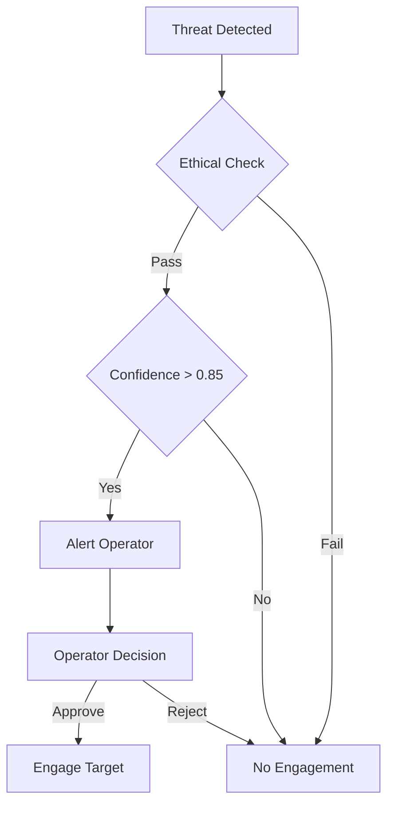

# MDX Classification Parser Specification

**Version:** 1.0.0
**Date:** 2025-11-22
**Purpose:** Extend MDX parser to recognize and render classification blocks with visual indicators

---

## Overview

This specification defines how to extend the existing MDX parser in `balans-website` to recognize classification blocks in markdown content and render them with visual indicators from the Balans design system.

### Context
- **Existing MDX parser:** `compression/1-sources/balans-red-cell/red-cell-ide/src/lib/` (handles mermaid blocks)
- **Design system:** `compression/99-output/lumens/balans-design-system.md` (classification colors and tokens)
- **Visual approach:** Layered indicators (border + icon + sticky bar) from design sessions

### Goal
Transform classification-marked markdown into visually indicated MDX components that clearly show content sensitivity levels.

---

## 1. Markdown Syntax Support

### 1.1 Primary Syntax: Container Directive

**Standard container directive syntax:**

```markdown
:::classification what="UNCLASSIFIED" how="SECRET"
## Implementation Details

This section contains implementation details that require SECRET clearance for the "how" dimension but are UNCLASSIFIED for the "what" dimension.

The algorithm uses confidence thresholds between 0.85 and 0.92 for decision making.
:::
```

**Attributes:**
- `what`: Defense "what" dimension (UNCLASSIFIED, CONFIDENTIAL, SECRET, TOP_SECRET)
- `how`: Defense "how" dimension (UNCLASSIFIED, CONFIDENTIAL, SECRET, TOP_SECRET)

### 1.2 Universal Semantic Syntax

**Simplified syntax for universal semantic classification:**

```markdown
::: unclassified
# Public Information
This is publicly available information with no access restrictions.
:::

::: protected-medical
## Lithium Schedule

Monday: 900mg (morning), 600mg (evening)
Tuesday: 900mg (morning), 600mg (evening)
...

*This medication schedule is protected information that cannot be modified in altered states.*
:::
```

**Quick classification shortcuts:**
- `unclassified` → what="UNCLASSIFIED" how="UNCLASSIFIED"
- `secret-how` → what="UNCLASSIFIED" how="SECRET"
- `protected-medical` → sensitivity="protected" domain="medical"
- `private-family` → sensitivity="private" domain="family"

### 1.3 HTML-Style Syntax (Alternative)

**For MDX-first content or complex nested scenarios:**

```markdown
<Classification what="UNCLASSIFIED" how="CONFIDENTIAL" sensitivity="private" domain="medical">

## Dual Classification Example

This content has **dual classification**:
- Defense: UNCLASSIFIED/CONFIDENTIAL
- Universal: Private medical information

*Requires medical domain expertise + CONFIDENTIAL defense clearance*

</Classification>
```

**Combined attributes allowed for maximum flexibility.**

---

## 2. MDX Transformation Rules

### 2.1 Container Directive Transformation

**Input:**
```markdown
:::classification what="UNCLASSIFIED" how="SECRET"
### Sensitive Algorithm

```python
def classify_threat(confidence: float) -> str:
    if confidence > 0.92:
        return "HIGH_THREAT"
    elif confidence > 0.85:
        return "MEDIUM_THREAT"
    else:
        return "LOW_THREAT"
```
:::
```

**Output:**
```tsx
<ClassificationBlock what="UNCLASSIFIED" how="SECRET">
<h3>Sensitive Algorithm</h3>

<pre><code className="language-python">def classify_threat(confidence: float) -> str:
    if confidence > 0.92:
        return "HIGH_THREAT"
    elif confidence > 0.85:
        return "MEDIUM_THREAT"
    else:
        return "LOW_THREAT"</code></pre>
</ClassificationBlock>
```

### 2.2 Nested Content Preservation

**The transformation preserves all nested markdown content:**
- Headers (h1-h6)
- Lists (ordered/unordered)
- Code blocks and inline code
- Links and images
- Tables and blockquotes
- **Even nested classification blocks** (though unusual)

### 2.3 HTML-Style Transformation

**Input:**
```markdown
<Classification sensitivity="critical" domain="defense">
## Emergency Protocol

**IMMEDIATE ACTION REQUIRED**

1. Isolate affected systems
2. Notify command chain
3. Execute contingency procedures
</Classification>
```

**Output:**
```tsx
<ClassificationBlock sensitivity="critical" domain="defense">
<h2>Emergency Protocol</h2>

<p><strong>IMMEDIATE ACTION REQUIRED</strong></p>

<ol>
<li>Isolate affected systems</li>
<li>Notify command chain</li>
<li>Execute contingency procedures</li>
</ol>
</ClassificationBlock>
```

---

## 3. React Component API

### 3.1 ClassificationBlock Component

**File:** `balans-website/src/components/ClassificationBlock.tsx`

```tsx
interface ClassificationBlockProps {
  // Defense dual classification (CIC/WeaverMesh)
  what?: 'UNCLASSIFIED' | 'CONFIDENTIAL' | 'SECRET' | 'TOP_SECRET';
  how?: 'UNCLASSIFIED' | 'CONFIDENTIAL' | 'SECRET' | 'TOP_SECRET';

  // Universal semantic classification
  sensitivity?: 'public' | 'internal' | 'private' | 'protected' | 'critical';
  domain?: 'family' | 'medical' | 'defense' | 'institutional';

  // Content
  children: React.ReactNode;
}

export function ClassificationBlock(props: ClassificationBlockProps) {
  // Determine primary classification level
  const level = determinePrimaryLevel(props);

  // Get visual metadata from design system
  const metadata = getClassificationMetadata(level, props.domain);

  return (
    <section
      className="classification-block"
      data-classification-level={level}
      data-domain={props.domain}
      style={{
        '--border-color': metadata.borderColor,
        '--background-color': metadata.backgroundColor,
      } as React.CSSProperties}
    >
      <ClassificationHeader metadata={metadata} props={props} />
      <div className="classification-content">
        {props.children}
      </div>
    </section>
  );
}
```

### 3.2 ClassificationHeader Subcomponent

```tsx
interface ClassificationHeaderProps {
  metadata: ClassificationMetadata;
  props: ClassificationBlockProps;
}

function ClassificationHeader({ metadata, props }: ClassificationHeaderProps) {
  return (
    <div className="classification-header">
      <span className="classification-icon">{metadata.icon}</span>
      <span className="classification-label">{metadata.label}</span>
      {props.what && props.how && (
        <span className="dual-classification">
          {props.what}/{props.how}
        </span>
      )}
      {props.sensitivity && (
        <span className="universal-classification">
          {props.sensitivity} ({props.domain})
        </span>
      )}
    </div>
  );
}
```

### 3.3 ClassificationStickyBar Component

**File:** `balans-website/src/components/ClassificationStickyBar.tsx`

```tsx
export function ClassificationStickyBar() {
  const currentLevel = useClassificationTracking();

  // Only show if there are classified blocks on page
  if (currentLevel === 'public' || currentLevel === 'unclassified') {
    return null;
  }

  const metadata = getClassificationMetadata(currentLevel);

  return (
    <div
      className="classification-sticky-bar"
      style={{ '--bar-bg': metadata.stickyBarColor } as React.CSSProperties}
    >
      <span className="sticky-icon">{metadata.icon}</span>
      <span className="sticky-label">
        Currently viewing: {metadata.label}
      </span>
      <span className="sticky-clearance">
        Requires {currentLevel} clearance
      </span>
    </div>
  );
}
```

---

## 4. Classification Metadata Mapping

### 4.1 Defense Dual Classification

```typescript
const defenseMetadata: Record<string, ClassificationMetadata> = {
  'UNCLASSIFIED': {
    icon: '🌐',
    label: 'UNCLASSIFIED',
    borderColor: '#2c5aa0', // Deep Swedish Blue
    backgroundColor: 'transparent',
    stickyBarColor: '#e3f2fd',
    textColor: '#1565c0'
  },
  'CONFIDENTIAL': {
    icon: '🔒',
    label: 'CONFIDENTIAL',
    borderColor: '#c9a96e', // Soft Thread Gold
    backgroundColor: '#fefce8',
    stickyBarColor: '#fef3c7',
    textColor: '#92400e'
  },
  'SECRET': {
    icon: '🛡️',
    label: 'SECRET',
    borderColor: '#d2691e', // Orange
    backgroundColor: '#fff7ed',
    stickyBarColor: '#fed7aa',
    textColor: '#9a3412'
  },
  'TOP_SECRET': {
    icon: '🚫',
    label: 'TOP SECRET',
    borderColor: '#dc2626', // Red
    backgroundColor: '#fef2f2',
    stickyBarColor: '#fecaca',
    textColor: '#991b1b'
  }
};
```

### 4.2 Universal Semantic Classification

```typescript
const universalMetadata: Record<string, ClassificationMetadata> = {
  'public': {
    icon: '🌍',
    label: 'Public',
    borderColor: '#2c5aa0',
    backgroundColor: 'transparent',
    stickyBarColor: '#eff6ff',
    textColor: '#1e40af'
  },
  'internal': {
    icon: '🏢',
    label: 'Internal',
    borderColor: '#2c7d6e', // Teal
    backgroundColor: '#f0fdfa',
    stickyBarColor: '#ccfbf1',
    textColor: '#115e59'
  },
  'private': {
    icon: '🔐',
    label: 'Private',
    borderColor: '#c9a96e',
    backgroundColor: '#fefce8',
    stickyBarColor: '#fef3c7',
    textColor: '#92400e'
  },
  'protected': {
    icon: '🛡️',
    label: 'Protected',
    borderColor: '#d2691e',
    backgroundColor: '#fff7ed',
    stickyBarColor: '#fed7aa',
    textColor: '#9a3412'
  },
  'critical': {
    icon: '🚨',
    label: 'Critical',
    borderColor: '#b87333', // Copper Red
    backgroundColor: '#fef2f2',
    stickyBarColor: '#fecaca',
    textColor: '#991b1b'
  }
};
```

### 4.3 Classification Level Determination

```typescript
function determinePrimaryLevel(props: ClassificationBlockProps): string {
  // Defense dual classification takes precedence
  if (props.how) {
    return props.how;
  }

  // Universal semantic classification
  if (props.sensitivity) {
    return props.sensitivity;
  }

  // Default to most restrictive if both present
  if (props.what && props.how) {
    return getHigherClassification(props.what, props.how);
  }

  // Fallback
  return 'public';
}

function getHigherClassification(a: string, b: string): string {
  const hierarchy = ['UNCLASSIFIED', 'CONFIDENTIAL', 'SECRET', 'TOP_SECRET'];
  const aIndex = hierarchy.indexOf(a);
  const bIndex = hierarchy.indexOf(b);
  return hierarchy[Math.max(aIndex, bIndex)];
}
```

---

## 5. Remark Plugin Implementation

### 5.1 Plugin Structure

**File:** `balans-website/src/lib/remark-classification.ts`

```typescript
import { visit } from 'unist-util-visit';
import type { Root } from 'mdast';

export function remarkClassification() {
  return (tree: Root) => {
    visit(tree, 'containerDirective', (node, index, parent) => {
      if (isClassificationDirective(node)) {
        const attributes = parseClassificationAttributes(node);
        const jsxNode = createClassificationJsx(node, attributes);

        if (parent && typeof index === 'number') {
          parent.children[index] = jsxNode;
        }
      }
    });
  };
}

function isClassificationDirective(node: any): boolean {
  return node.name === 'classification' ||
         ['unclassified', 'secret-how', 'protected-medical', 'private-family', 'critical-defense'].includes(node.name);
}

function parseClassificationAttributes(node: any) {
  // Handle :::classification what="X" how="Y" syntax
  if (node.name === 'classification' && node.attributes) {
    return node.attributes;
  }

  // Handle shortcut syntax (::: secret-how)
  return parseShortcutSyntax(node.name);
}

function createClassificationJsx(node: any, attributes: any) {
  return {
    type: 'mdxJsxFlowElement',
    name: 'ClassificationBlock',
    attributes: Object.entries(attributes).map(([name, value]) => ({
      type: 'mdxJsxAttribute',
      name,
      value: typeof value === 'string' ? value : JSON.stringify(value)
    })),
    children: node.children,
    data: { _mdxExplicitJsx: true }
  };
}
```

### 5.2 HTML-Style Parsing

**Extension for HTML-style syntax:**

```typescript
// Add to the plugin
visit(tree, 'html', (node, index, parent) => {
  if (isClassificationHtml(node.value)) {
    const { attributes, content } = parseClassificationHtml(node.value);
    const jsxNode = createClassificationJsxFromHtml(content, attributes);

    if (parent && typeof index === 'number') {
      parent.children[index] = jsxNode;
    }
  }
});
```

---

## 6. CSS Styling Specification

### 6.1 Classification Block Styles

**File:** `balans-website/src/styles/classification.css`

```css
.classification-block {
  position: relative;
  border-left: 4px solid var(--border-color, #2c5aa0);
  background-color: var(--background-color, transparent);
  margin: 2rem 0;
  padding: 1rem 1.5rem 1rem 2rem;
  border-radius: 0.5rem;
}

.classification-header {
  display: flex;
  align-items: center;
  gap: 0.5rem;
  margin-bottom: 1rem;
  font-size: 0.875rem;
  font-weight: 600;
  color: var(--text-color, #374151);
}

.classification-icon {
  font-size: 1.25rem;
}

.classification-label {
  text-transform: uppercase;
  letter-spacing: 0.05em;
}

.dual-classification,
.universal-classification {
  margin-left: auto;
  font-size: 0.75rem;
  opacity: 0.8;
}
```

### 6.2 Sticky Bar Styles

```css
.classification-sticky-bar {
  position: fixed;
  top: 0;
  left: 0;
  right: 0;
  z-index: 50;
  background-color: var(--bar-bg, #2c5aa0);
  color: white;
  padding: 0.5rem 1rem;
  display: flex;
  align-items: center;
  gap: 0.75rem;
  font-size: 0.875rem;
  font-weight: 500;
  box-shadow: 0 2px 4px rgba(0, 0, 0, 0.1);
}

.sticky-icon {
  font-size: 1.125rem;
}

.sticky-clearance {
  margin-left: auto;
  opacity: 0.9;
}
```

### 6.3 Accessibility Styles

```css
/* High contrast mode */
@media (prefers-contrast: high) {
  .classification-block {
    border-left-width: 6px;
    border-left-style: double;
  }
}

/* Reduced motion */
@media (prefers-reduced-motion: reduce) {
  .classification-sticky-bar {
    transition: none;
  }
}

/* Print styles */
@media print {
  .classification-sticky-bar {
    display: none;
  }

  .classification-block::before {
    content: attr(data-classification-level) " CLASSIFICATION";
    font-weight: bold;
    display: block;
    margin-bottom: 0.5rem;
  }
}
```

---

## 7. Integration & Configuration

### 7.1 MDX Configuration

**File:** `balans-website/src/lib/mdx.ts` (or similar)

```typescript
import { remarkClassification } from './remark-classification';

export const mdxOptions = {
  remarkPlugins: [
    // ... existing plugins
    remarkClassification,
  ],
  // ... other options
};
```

### 7.2 Component Registration

**File:** `balans-website/src/components/index.ts`

```typescript
export { ClassificationBlock } from './ClassificationBlock';
export { ClassificationStickyBar } from './ClassificationStickyBar';
```

### 7.3 Page-Level Integration

**In page layouts or specific pages:**

```tsx
import { ClassificationStickyBar } from '@/components/ClassificationStickyBar';

export default function Layout({ children }) {
  return (
    <div>
      <ClassificationStickyBar />
      <main>{children}</main>
    </div>
  );
}
```

---

## 8. Examples by Domain

### 8.1 Defense Domain Example

```markdown
:::classification what="UNCLASSIFIED" how="SECRET"
## Autonomous Turret Decision Algorithm

The Guardian Protocol implements a three-tier decision framework:

1. **Ethical Assessment**: Is engagement proportional and necessary?
2. **Confidence Validation**: Does AI confidence exceed 0.85 threshold?
3. **Human Confirmation**: Operator must approve all lethal engagements


:::
```

### 8.2 Medical Domain Example

```markdown
::: protected-medical
## Lithium Maintenance Schedule

**Protected Medical Information - Guardian Locked**

### Weekly Dosage Protocol
- **Monday-Friday**: 900mg morning, 600mg evening
- **Saturday-Sunday**: 800mg morning only (reduced weekend dose)
- **Monitoring**: Weekly blood tests, symptom tracking

### Guardian Lock Rules
- Cannot modify schedule when lithium levels are outside 0.6-1.0 mEq/L
- Requires stable mood state for 48 hours before changes
- Automatic alerts if schedule adherence drops below 85%

*This schedule is protected to prevent medication errors in altered states.*
:::
```

### 8.3 Family Domain Example

```markdown
::: private-family
## Parent Financial Planning Discussion

**Private Family Information - Not for Children**

### Current Household Budget
- **Monthly Income**: €8,200 (after taxes)
- **Housing**: €2,800 (mortgage + utilities)
- **Education**: €1,200 (private school for children)
- **Savings Rate**: 22% (€1,804/month)

### Investment Strategy Discussion
- **Emergency Fund**: 12 months expenses (€33,000 target - currently €28,000)
- **Retirement**: Max 401(k) contributions + Roth IRA
- **College Fund**: 529 plans for both children
- **Risk Tolerance**: Moderate (60% stocks, 40% bonds)

### Teen Employment Discussion
- **Part-time Job**: €12/hour at local café
- **Hours**: 15 hours/week maximum (school priority)
- **Tax Implications**: Under €10,000/year, no federal tax
- **Savings Plan**: 30% to personal account, 70% spending money

*This discussion contains sensitive financial information not appropriate for children.*
:::
```

---

## 9. Accessibility Requirements

### 9.1 Screen Reader Support

```tsx
// In ClassificationBlock component
<section
  role="region"
  aria-label={`Classified content: ${metadata.label}`}
  aria-describedby="classification-description"
>
  <div id="classification-description" className="sr-only">
    This content is classified as {metadata.label}.
    {props.what && props.how ? ` Defense classification: ${props.what}/${props.how}.` : ''}
    {props.sensitivity ? ` ${props.sensitivity} sensitivity in ${props.domain} domain.` : ''}
  </div>
  {/* content */}
</section>
```

### 9.2 Keyboard Navigation

- **Tab order**: Classification headers included in tab sequence
- **Focus indicators**: Clear visual focus for keyboard users
- **Escape key**: Option to dismiss sticky bar if needed
- **Skip links**: Allow jumping over classified sections

### 9.3 Colorblind Accessibility

- **Icon + Text**: Never rely on color alone
- **Shape coding**: Different border styles for different levels
- **Pattern overlays**: Additional visual patterns for distinction
- **High contrast**: Minimum 4.5:1 ratio maintained

---

## 10. Testing Scenarios

### 10.1 Basic Functionality Tests

- [ ] Container directive transforms to JSX
- [ ] HTML-style syntax transforms to JSX
- [ ] Attributes correctly parsed and passed
- [ ] Nested markdown content preserved
- [ ] Multiple classification blocks on same page

### 10.2 Visual Indicator Tests

- [ ] Border color matches classification level
- [ ] Header icon displays correctly
- [ ] Label text shows appropriate classification
- [ ] Background color subtle but visible
- [ ] Sticky bar appears when classified content visible

### 10.3 Interaction Tests

- [ ] Sticky bar updates when scrolling through different classifications
- [ ] Higher classification takes precedence in sticky bar
- [ ] Sticky bar disappears on public/unclassified content
- [ ] Mobile responsive behavior works

### 10.4 Accessibility Tests

- [ ] Screen reader announces classification changes
- [ ] Keyboard navigation works through classified sections
- [ ] High contrast mode displays correctly
- [ ] Print styles include classification headers

---

## 11. Edge Cases & Error Handling

### 11.1 Invalid Classification Values

```typescript
// Handle unknown classification gracefully
function validateClassification(level: string): string {
  const validLevels = [
    'UNCLASSIFIED', 'CONFIDENTIAL', 'SECRET', 'TOP_SECRET',
    'public', 'internal', 'private', 'protected', 'critical'
  ];

  if (!validLevels.includes(level)) {
    console.warn(`Invalid classification: ${level}, defaulting to 'public'`);
    return 'public';
  }

  return level;
}
```

### 11.2 Conflicting Attributes

```typescript
// Resolve conflicts between dual and universal classification
function resolveClassificationConflict(props: ClassificationBlockProps): string {
  // Defense classification takes precedence for defense domain
  if (props.domain === 'defense' && props.how) {
    return props.how;
  }

  // Use universal for other domains
  if (props.sensitivity) {
    return props.sensitivity;
  }

  // Default to most restrictive
  return 'public';
}
```

### 11.3 Nested Classification Blocks

```markdown
::: secret-how
## Top Level Secret

This contains a subsection that is even more sensitive:

::: critical-defense
### Critical Subsection

This subsection requires TOP SECRET clearance.
:::

Back to secret level content.
:::
```

**Rendering:** Nested blocks show highest classification level in sticky bar.

---

## 12. Performance Considerations

### 12.1 Intersection Observer Optimization

```typescript
// Debounce sticky bar updates
const [debouncedLevel, setDebouncedLevel] = useState('public');
const timeoutRef = useRef<NodeJS.Timeout>();

useEffect(() => {
  if (timeoutRef.current) {
    clearTimeout(timeoutRef.current);
  }

  timeoutRef.current = setTimeout(() => {
    setDebouncedLevel(currentLevel);
  }, 100); // 100ms debounce

  return () => {
    if (timeoutRef.current) {
      clearTimeout(timeoutRef.current);
    }
  };
}, [currentLevel]);
```

### 12.2 Memory Management

- **Observer cleanup**: Disconnect intersection observers on unmount
- **Event throttling**: Limit scroll event frequency
- **Lazy loading**: Only load classification metadata when needed
- **Component memoization**: Prevent unnecessary re-renders

---

## 13. Browser Compatibility

### 13.1 Required Features

- **Intersection Observer API**: For sticky bar tracking (polyfill available)
- **CSS Custom Properties**: For dynamic color theming
- **MDX JSX**: For component transformation
- **ES2020+**: For modern JavaScript features

### 13.2 Fallback Strategies

- **No Intersection Observer**: Sticky bar shows highest page classification
- **No CSS Custom Properties**: Inline styles as fallback
- **No MDX**: Render as plain HTML with class annotations
- **Legacy Browsers**: Graceful degradation to basic styling

---

## 14. Future Extensions

### 14.1 Granular Classification

```markdown
:::classification what="UNCLASSIFIED" how="SECRET"
This paragraph is SECRET.

::: inline-classification sensitivity="critical"
This **specific sentence** is critical information.
:::

Back to SECRET level.
:::
```

### 14.2 Dynamic Classification

```tsx
// API-driven classification levels
<ClassificationBlock classification={apiResponse.classification}>
  {apiResponse.content}
</ClassificationBlock>
```

### 14.3 Classification Workflows

- **Approval workflows**: Content requires approval before publishing
- **Audit trails**: Track who viewed classified content when
- **Expiration**: Content automatically declassifies after time period
- **Geographic restrictions**: Different classifications for different regions

---

*This specification provides complete implementation guidance for classification-aware MDX parsing. The design balances security visualization with usability, ensuring sensitive content is clearly marked while remaining accessible to authorized viewers.*
