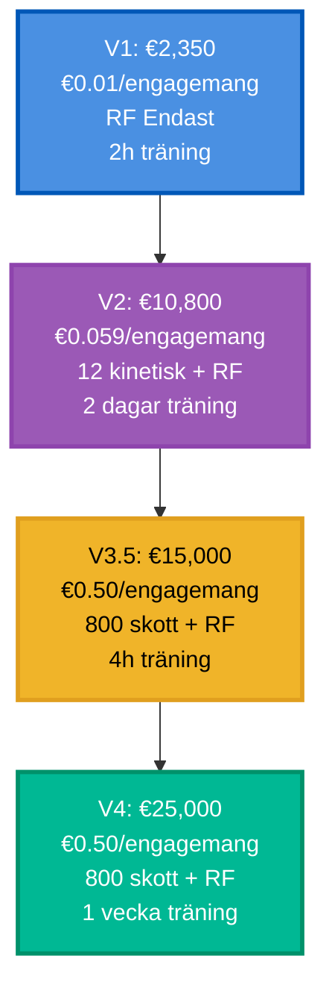
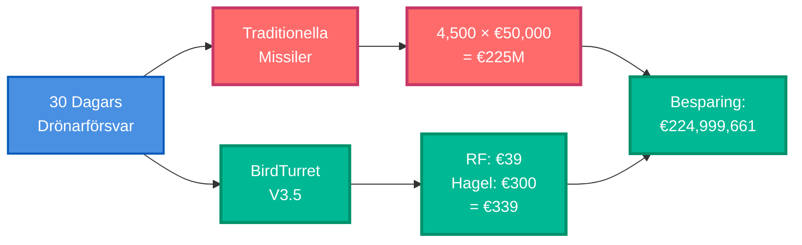

# BirdTurret Kostnadsanalys

## Klassificering: BEGRÄNSAD HEMLIG

## Systemkostnader per Version

**Jämförelsetabell:**

| Kategori | V1 | V2 | V3.5 | V4 |
|----------|----|----|------|-----|
| **Hårdvara** | €2,350 | €10,800 | €15,000 | €25,000 |
| **Per Engagemang** | €0.01 | €0.059 | €0.50 | €0.50 |
| **Kapacitet** | Obegränsad RF | 12 kinetisk + RF | 800 skott + RF | 800 skott + RF |
| **Träningstid** | 2 timmar | 2 dagar | 4 timmar | 1 vecka |
| **Autonomi** | Ingen | Ingen | Delvis | Full |

## Jämförelse med Alternativ

### Traditionella Missilsystem

**Stinger Missil**:
- Kostnad per skott: €50,000
- Effektiv räckvidd: 4.8 km
- Träningstid: 6 veckor
- **BirdTurret fördel**: 100,000× billigare per engagemang

**Crotale NG**:
- Systemkostnad: €60M
- Kostnad per missil: €400,000
- Effektiv räckvidd: 11 km
- **BirdTurret fördel**: 800,000× billigare per engagemang

### Endast RF-Störningssystem

**SkyWall 300**:
- Systemkostnad: €50,000
- Kostnad per nät: €500
- Effektiv räckvidd: 100m
- Kapacitet: 8 skott
- **BirdTurret fördel**: 3.3× billigare system, 100× mer kapacitet

## Ukraina Kontext Ekonomi

**Ukraina Drönar Hotskala** (Nov 2025):
- 500-600 drönare/dag
- ~30% engagemangsfrekvens (150-180 engagemang/dag)

### Kostnadsjämförelse (30-dagarsperiod)

**Traditionella Missiler** (4,500 engagemang):
- Kostnad: 4,500 × €50,000 = **€225,000,000** (€225M)

**BirdTurret V3.5** (4,500 engagemang):
- Primär (RF): 3,900 × €0.01 = €39
- Sekundär (hagelgevär): 600 × €0.50 = €300
- **Totalt: €339**

**Besparingar**: €224,999,661 per månad per FOB

**BirdTurret system behövda** (förutsatt 100m perimetertäckning):
- 30 FOBs × 1 system = 30 system
- Systemkostnad: 30 × €15,000 = €450,000
- **Återbetalningstid: 2 dagar** (vs missilkostnader)

## Operativ Kostnadsanalys

### Personalkostnader (Eliminerade i V4)

**Traditionellt Luftförsvar**:
- 24/7 täckning: 4 operatörer × 3 skift = 12 personal
- Årslön: 12 × €40,000 = €480,000/år

**BirdTurret V4 (Autonom)**:
- 24/7 täckning: 1 övervakare
- Årslön: €40,000/år
- **Besparingar**: €440,000/år per system

### Underhållskostnader

**BirdTurret**:
- Årligen: €2,000 (mjukvaruuppdateringar, kalibrering)
- Komponentersättning: €500/år genomsnitt

**Traditionella System**:
- Årligen: €50,000+ (missillagring, vägledningsuppdateringar)

## ROI Kalkyl

**BirdTurret V4 Investering**:
- Initial: €25,000 (system)
- Årligen: €42,000 (1 operatör + underhåll)
- **Total År 1**: €67,000

**Traditionellt System**:
- Initial: €60M (Crotale NG)
- Årligen: €480,000 (12 operatörer) + €50,000 (underhåll) = €530,000
- **Total År 1**: €60,530,000

**Break-even**: Omedelbart (systemkostnadsskillnad betalar sig själv med första engagemanget)

## Skalbarhet

**1,000 FOB Utplac

ering** (Ukraina skala):

**BirdTurret V4**:
- System: 1,000 × €25,000 = €25M
- Operatörer: 1,000 × €40,000 = €40M/år
- **Total 5-år**: €225M

**Traditionella Missiler**:
- System: 1,000 × €60M = €60,000M (€60B)
- Operatörer: 1,000 × €480K = €480M/år
- **Total 5-år**: €62,400M (€62.4B)

**Besparingar**: €62,175M (€62.2B) över 5 år

## Slutsats

BirdTurret representerar en **strukturell kostnadsfördel** i drönarförsvar:
- 100,000× billigare per engagemang (hagelgevär vs missil)
- Obegränsad RF-störningskapacitet (ingen kostnad per skott)
- Autonom drift minskar personal 12:1
- Återbetalningstid: Dagar (inte år)

**Strategisk Implikation**: Vid Ukraina hotskala blir kostnadseffektivt försvar ekonomiskt genomförbart. Traditionella missilbaserade system är ohållbara vid 500-600 drönare/dag.
