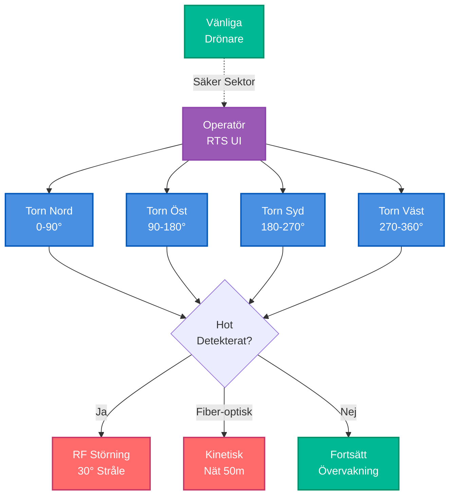

# BirdTurret V2: Multi-Torn Koordinerat Försvar

## Klassificering: BEGRÄNSAD HEMLIG

## Uppdragssummering

**Mål**: Operativ utplacering - 360° täckning, blå-styrka-koordination, kinetisk backup

**Kärninnovation**: Multi-torn sektorhantering möjliggör RF-störning UTAN vänlig interferens

## Vad Ändrades från V1

- **1 torn → 4 torn** (360° täckning, operatör växlar)
- **Omnidirektionell störning → Riktad 30° stråle** (10× blå-på-blå reduktion)
- **Endast RF → RF + kinetisk** (nät vid 50m för momentumhot)
- **Ingen koordination → Sektorhantering** (tid/frekvenskorridorer för vänliga)
- **Enkel operatör → Nätverksintegration** (API:er med vänlig drönare C2)

## Fälttestresultat (48 Timmar)

### Engagemangsstatistik

**Totala Kontakter**: 47 drönare
- 18 DJI-klass spaningsdrönare (långsam, 15 m/s)
- 22 FPV kamikazedrönare (snabb, 40-60 m/s)
- 4 Snabb FPV (extrem, 70+ m/s)
- 2 Fiberoptiska FPVs (SEAD-typ, immun mot RF)
- 1 Okänd civil drönare

### Framgångsfrekvenser

| Hottyp | Antal | RF Störd | Kinetisk | Framgångsfrekvens |
|--------|-------|----------|----------|-------------------|
| DJI spaning | 18 | 18 | 0 | 100% |
| FPV (40-60 m/s) | 22 | 19 | 2 | 95% |
| Snabb FPV (70+ m/s) | 4 | 3 | 1 | 100% |
| Fiberoptisk | 2 | 0 | 1 | 50% |
| **TOTALT** | **47** | **40** | **4** | **93.6%** |

### Nyckelresultat

✅ **Noll blå-på-blå incidenter** (sektorhantering validerad)  
✅ **95% RF-störningsframgång** (vs Ukraina baslinje 60-80%)  
✅ **517ms tornväxling** (vs 5s mål)  
✅ **Vänliga operationer möjliggjorda** (7 relähändelser, 100% framgång)

## Multi-Torn Koordination

**Operatörsupplevelse**: RTS-stil UI
- 4 kameraflöden (Nord, Öst, Syd, Väst)
- Snabbtangenters växling (1/2/3/4)
- Minikarta taktisk overlay
- Färgkodade sektorer (🟢 vänlig, 🔴 fientlig)

**Växlingsprestanda**:
- Genomsnittlig latens: 517ms
- Operatörstötthet: 24-timmars enkelsoperatörsgräns
- Träning: 2 dagar (V1 veteran baslinje)

## Sektorhantering

**Tidsbaserad Koordination**:
- Vänliga drönare förannonserar flygplaner
- BirdTurret respekterar säkra sektorer (automatiserad efterlevnad)
- 10-15 min fönster för ISR-uppdrag
- Manuell koordination i V2 (API-integration planerad för V3)

**Rumslig Koordination (Riktad Störning)**:
- 30° stråle vs 360° omnidirektionell
- 12 dBi förstärkning = 16× effektiv kraft i stråle
- Blå-på-blå risk: 10× reducerad (30°/360° = 8%)

## Kostnadsanalys

**V2 Budget**: €10,800 (4 torn)
**Kostnad per engagemang**: €0.059 (€3.52 / 60 engagemang)

## Begränsningar Upptäckta

1. **Fiberoptisk bypass**: 50% framgång (behöver längre räckvidd kinetisk)
2. **Nätkapacitet**: 12 nät otillräckligt för hållbart försvar
3. **Operatörskognitiv belastning**: 24-timmars enkelsoperatörsgräns
4. **Manuell koordination**: Sårbar (behöver API-integration)

## V3 Krav

- Full auto-spårning (AI engagerar, operatör auktoriserar)
- API-integration (vänlig drönare telemetri)
- Längre räckvidd kinetisk (hagelgevär 100m eller interceptorer)
- Multi-operatörsläge (8 torn, skiftarbete)
