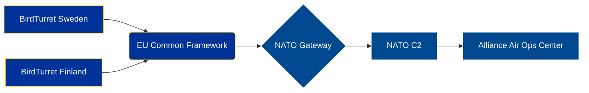

# 🇪🇺 EU-NATO Joint Training Protocol

**Classification:** EU RESTRICTED  
**Applies to:** EU Member States participating in NATO interoperability exercises  
**Distribution:** Authorized personnel with EU RESTRICTED clearance

---

## Overview

This document outlines coordination protocols for joint EU-NATO counter-UAS training exercises. Information herein is classified EU RESTRICTED and must be handled according to Council Decision 2013/488/EU.

**Note:** While handled under similar frameworks as Swedish "Begränsad Hemlig" (BH), EU RESTRICTED is a distinct classification requiring EU-specific audit trails and declassification procedures.

---

## Training Objectives

### Primary Goals
1. **Interoperability Testing**
   - Verify EU and NATO C-UAS systems can share threat data
   - Test common communication protocols
   - Validate joint command structures

2. **Capability Assessment**
   - Evaluate BirdTurret compatibility with NATO C2 systems
   - Test EU common security framework integration
   - Assess multi-national response coordination

3. **Knowledge Transfer**
   - Share best practices across EU member states
   - Document lessons learned for NATO partnership
   - Build institutional memory for future operations

---

## Participation Framework

### EU Member States
- **Lead Nation:** Sweden (FMV coordination)
- **Participating Nations:** Finland, Estonia, Poland
- **Observer Status:** Latvia, Lithuania

### NATO Integration
- **Liaison Officers:** 2 per participating nation
- **Technical Advisors:** NATO SHAPE representatives
- **Doctrine Alignment:** NATO ATP-3.3.8.1 (Counter-UAS Operations)

---

## Exercise Scenarios

### Scenario 1: Urban Swarm Defense
**Location:** Simulated city environment  
**Threat:** 15-drone coordinated swarm  
**Systems Tested:**
- BirdTurret V3.5 (Swedish/Finnish units)
- [REDACTED] (Polish system)
- NATO C2 integration layer

**Success Criteria:**
- 90% threat neutralization rate
- Response time <60 seconds
- Zero friendly fire incidents

### Scenario 2: Critical Infrastructure Protection
**Location:** Port facility simulation  
**Threat:** Reconnaissance drones + kamikaze payloads  
**Systems Tested:**
- Multi-layer defense (RF jamming + kinetic)
- Cross-border coordination (Sweden-Finland)
- NATO AWACS integration

**Success Criteria:**
- 100% infrastructure integrity maintained
- Coordinated response across 2 national systems
- Real-time threat sharing functional

---

## Technical Integration Points

### Communication Protocols

**Key Integration:**
- **EU Layer:** Common Situational Awareness (CSA) protocol
- **NATO Layer:** Link 16 tactical data link
- **Translation:** Automated mapping between EU and NATO formats

### Data Sharing Constraints
- **Threat Intelligence:** Real-time sharing authorized
- **Capability Details:** EU RESTRICTED → NATO RESTRICTED mapping required
- **National Systems:** Requires bilateral approval for specific data

---

## Security Considerations

### Classification Handling
⚠️ **IMPORTANT:** This document is classified **EU RESTRICTED**.

**Swedish Context:**
- Handled under Säkerhetsskyddslagen (2018:585)
- **Same regulatory framework as BH**, but legally distinct
- Requires EU-specific audit trail

**Access Control:**
- SaaS Lumen AI service (minimum clearance: EU-R/BH equivalent)
- Personnel must have **both** national and EU clearances
- Cross-border access requires coordination with EU Council Secretariat

### Declassification
- **Automatic:** None (manual review required)
- **EU Process:** Council Decision 2013/488/EU Article 8
- **Swedish Process:** FMV coordination with MSB
- **Timeline:** Earliest 2029 (5-year review cycle)

---

## Logistics & Coordination

### Exercise Timeline
- **Planning Phase:** Q1 2025
- **Technical Prep:** Q2 2025
- **Main Exercise:** June 15-20, 2025
- **After-Action Review:** July 2025

### Resource Requirements
- **Personnel:** 45 (EU) + 12 (NATO)
- **Equipment:** 8 BirdTurret units, NATO C2 terminals
- **Facilities:** Swedish Defence Materiel Administration (FMV) test range

### Budget
- **EU Contribution:** €450,000 (from Common Security Framework)
- **National Co-funding:** €200,000 (Sweden/Finland split)
- **NATO Support:** In-kind (liaison personnel, C2 infrastructure)

---

## Points of Contact

### Exercise Coordinators
- **EU Lead:** [REDACTED], FMV Sweden
- **NATO Liaison:** [REDACTED], SHAPE Belgium
- **Technical Lead:** [REDACTED], BirdTurret Systems AB

### Security Officers
- **EU Classification:** [REDACTED], Council Secretariat
- **Swedish Security:** [REDACTED], FMV Säkerhetsskydd
- **NATO Security:** [REDACTED], NCIA

---

## Appendices

### A. Acronym List
- **C-UAS:** Counter-Unmanned Aircraft System
- **CSA:** Common Situational Awareness
- **FMV:** Försvarets Materielverk (Swedish Defence Materiel Administration)
- **SHAPE:** Supreme Headquarters Allied Powers Europe
- **ATP:** Allied Tactical Publication

### B. Related Documents
- NATO ATP-3.3.8.1 (Counter-UAS Operations) - **NATO RESTRICTED**
- EU Common Security Framework Implementation Guide - **EU RESTRICTED**
- Swedish BirdTurret Export Guidelines - **Begränsad Hemlig**

### C. Legal Framework
- Council Decision 2013/488/EU on security rules for protecting EU classified information
- Säkerhetsskyddslagen (2018:585) - Swedish Security Protection Act
- NATO Security Policy (C-M(2002)49)

---

**Document Control:**
- **Version:** 1.2
- **Last Modified:** 2024-11-15
- **Review Date:** 2025-06-01
- **Classification Authority:** EU Council Secretariat
- **Swedish Authority:** FMV Säkerhetsskydd
- **Distribution:** Authorized EU member state representatives only

**⚠️ HANDLING NOTICE:**  
This document contains EU RESTRICTED information. Unauthorized disclosure may damage the interests of the European Union or one or more of its member states. Handle according to Council Decision 2013/488/EU and national security regulations.

