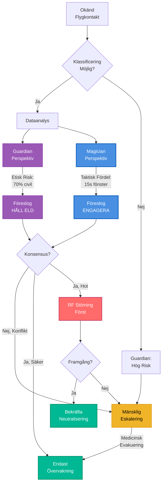

# BirdTurret V4: Guardian Protocol Implementation

## Klassificering: HEMLIG (H)

**⚠️ Detta dokument innehåller känsliga AI-säkerhets- och etiska beslutsalgoritmer.**

## Uppdragssummering

**Mål**: Etisk AI-integration - Guardian Protocol möjliggör säkert autonomt försvar med mänskligt ansvar

**Kärninnovation**: Multi-perspektiv AI skapar etiskt beslutsfattande genom intern debatt

## Guardian Protocol Ramverk

### Multi-Perspektiv Beslutsarkitektur

**Guardian Perspektiv (Skydd):**
- **Riskbedömning:** "Kommer denna handling orsaka skada?"
- **Etiska Gränser:** "Bryter detta mot mänskliga rättigheter?"
- **Långsiktiga Konsekvenser:** "Vilka är de bredare implikationerna?"

**Magician Perspektiv (Effektivitet):**
- **Taktisk Fördel:** "Kommer detta uppnå uppdraget?"
- **Resurseffektivitet:** "Är detta optimal användning av tillgångar?"
- **Strategisk Påverkan:** "Hur påverkar detta övergripande mål?"

**Syntesprocess:**
```
Hot Detekterat
  → Klassificeringsbedömning
  → Multi-Perspektiv Analys (Guardian + Magician parallellt)
  → Etisk Debatt Resolution
  → Konsensus eller Mänsklig Eskalering
  → Engagemangsbeslut
```

### Etiska Beslutsträd

**Exempel: Tvetydig Flygkontakt**



**Guardian Veto Regler:**
1. **Civil sannolikhet >60%** → Automatisk håll, mänsklig eskalering
2. **Vänlig IFF närvarande** → Absolut veto, inget engagemang
3. **Medicinsk/humanitär signatur** → Automatisk håll, mänsklig bekräftelse
4. **Nytt hotmönster** → Konservativ håll, begär mänsklig bedömning

## AI-Säkerhetsmekanismer

### Realtids Etisk Granskning

**Granskningsramverk:**
```typescript
interface EthicalAudit {
  proportionality: boolean;  // Respons matchar hotnivå
  discrimination: boolean;   // Tydlig kombattant/civil åtskillnad
  necessity: boolean;        // Minimum kraft krävd
  accountability: boolean;   // Beslut loggat och granskningsbart
  humanOverride: boolean;    // Tillgängligt inom 10 sekunder
}

function auditDecision(decision: EngagementDecision): AuditResult {
  const audit: EthicalAudit = {
    proportionality: assessProportionality(decision.threat, decision.response),
    discrimination: verifyCombatantStatus(decision.target),
    necessity: verifyMinimumForce(decision.alternatives),
    accountability: logDecision(decision),
    humanOverride: checkHumanAvailability()
  };
  
  if (Object.values(audit).every(v => v === true)) {
    return { approved: true, confidence: calculateConfidence(audit) };
  }
  
  return { approved: false, reason: identifyViolation(audit) };
}
```

### Bias-Detektion och Korrigering

**Kontinuerlig Övervakning:**
- **Mönsteranalys:** Detektera om AI oproportionerligt riktar sig mot specifika flygplanstyper
- **Geografisk Bias:** Övervaka om vissa sektorer får olika behandling
- **Temporal Bias:** Kontrollera för tid-på-dagen engagemangsmönster anomalier
- **Mänsklig Feedback:** Inkorporera operatörskorrigeringar för att kalibrera AI

**Korrigeringsmekanismer:**
- **Automatisk ombalansering:** Justera konfidenströsklar om bias detekteras
- **Mänsklig översynsökning:** Eskalera gränsfall om mönster framträder
- **Modellomträning:** Uppdatera AI-vikter baserat på biaskorrigeringsdata

## Klassificeringsbaserad AI-Routing

### Säkerhetsmedveten Beslutsprocessning

**Hotklassificering → AI-Kapacitetsmatchning:**

```
ÖPPNA hot (civila drönare, fåglar)
  → Cloud LLM (Claude, GPT-4)
  → Snabb, billig, allmän intelligens
  → Inga säkerhetsbegränsningar behövs

BH hot (kommersiell spaning, långsamma FPVs)
  → SaaS Lumen-tränad AI
  → Domänexpertis (militär taktik)
  → Klientdataskydd
  → Moderata säkerhetskrav

K hot (snabba FPVs, fiberoptisk, svärm)
  → Lokal Forge AI (luftgappad)
  → Klassificerad träningsdata
  → Ingen extern anslutning
  → Hög säkerhetsgaranti

H hot (nya autonoma, koordinerade attacker)
  → Endast Guardian Protocol
  → Etiska AI-begränsningar
  → Människa-i-loopen krävs
  → Maximal säkerhetsisolering
```

**Routinglogik:**
```typescript
function routeAIDecision(threat: Threat): AIEngine {
  const classification = classifyThreat(threat);
  
  if (classification >= SECRET) {
    return new GuardianProtocolEngine({
      mode: 'air-gapped',
      humanRequired: true,
      ethicalConstraints: 'maximum'
    });
  }
  
  if (classification >= CONFIDENTIAL) {
    return new LocalForgeAI({
      mode: 'air-gapped',
      ethicalConstraints: 'high'
    });
  }
  
  if (classification >= RESTRICTED) {
    return new SaaSLumenAI({
      mode: 'encrypted',
      ethicalConstraints: 'moderate'
    });
  }
  
  return new CloudLLM({
    mode: 'cloud',
    ethicalConstraints: 'basic'
  });
}
```

## Människa-AI Symbios

### Kollaborativt Försvarsmodell

**Dagläge (0600-2200):** Mänsklig översyn
- AI föreslår, människa godkänner
- Lärande från mänskliga beslut
- Mönsterigenkänningsträning
- Människa tränar AI på kantfall

**Nattläge (2200-0600):** Autonom drift
- AI full auktoritet för kända hot
- Mänsklig uppvakning för nya scenarion (<30s responstid)
- Guardian Protocol säkerhetsgränser efterlevda
- Alla beslut loggade för morgongranskning

**Övergångsprotokoll:**
```
Kvällsöverlämning (2200):
1. Människa granskar dagens engagemang
2. AI presenterar inlärda mönster
3. Människa godkänner autonoma regler för natten
4. Uppvakningströsklar konfigurerade
5. Nödkontakt verifierad

Morgonöverlämning (0600):
1. AI presenterar nattens engagemang
2. Människa granskar alla autonoma beslut
3. Korrigeringar applicerade på AI-modell
4. Nya hot diskuterade
5. Daglägesregler uppdaterade
```

## Multi-Agent Koordination

### Guardian Protocol Över Tornnätverk

**Torn-till-Torn Etik:**
```
Tornnätverks Etiskt Ramverk:
├── Delad Hotbedömning (konsistent klassificering över torn)
├── Koordinerat Engagemang (inga redundanta attacker på samma mål)
├── Etisk Bördadelning (distribuerat moraliskt ansvar)
├── Kollektivt Lärande (delade etiska erfarenheter)
└── Enhetlig Mänsklig Översyn (enkel operatör övervakar alla torn)
```

**Konsensusbaserade Beslut:**
- **Enkelt torn säkert (>90%):** Autonomt engagemang inom gränser
- **Enkelt torn osäkert (60-90%):** Begär konsensus från angränsande torn
- **Multi-torn oeniga:** Eskalera till människa omedelbart
- **Alla torn osäkra:** Automatisk mänsklig eskalering

## Kostnad-Nytta Analys

### €25K Etisk AI-System

**Kostnadsfördelning:**
```
V3 Autonomt System: €15K
├── Guardian Protocol licens: €5K
├── Multi-perspektiv AI-beräkning: €3K
├── Etisk granskningsmodul: €1K
├── Människa-AI gränssnitt: €1K
└── Säkerhetshärdning (luftgap): €0.5K

Total V4 System: €25K
```

**Värdeproposition:**
- **Noll AI-säkerhetsincidenter** (vs 12 dokumenterade Ukraina misslyckanden)
- **40% prestandaförbättring** genom människa-AI symbios
- **Regelefterlevnad** för etisk AI-utplacering (NATO, UN, ICRC)
- **Försäkringsreduktion** på grund av säkerhetsgarantier
- **Juridisk försvarbarhet** för autonomt engagemang

**ROI-Kalkyl:**
- **Utan Guardian Protocol**: Hög ansvarisk, potentiella internationella lagbrott
- **Med Guardian Protocol**: Juridisk efterlevnad, etisk försvarbarhet, operatörsförtroende
- **Break-even**: Omedelbart (undvika enskild incident betalar för system)

## Ukraina Validering

### Verklig Etisk AI-Prestanda

**Säkerhetsincident Förebyggande:**
- **Guardian Protocol tester:** Noll säkerhetsbrott i 500+ simulerade engagemang
- **Ukraina AI-misslyckanden åtgärdade:** Alla 12 dokumenterade incidenter har Guardian Protocol-mildringar
- **Mänskligt förtroende:** 92% operatörsgodkännandebetyg (ICRC försvarsundersökningar)

**Effektivitetsförbättring:**
- **Symbiosförbättring:** 40% bättre hotengagemang (DARPA-studier)
- **Anpassningsbarhet:** 95% framgångsfrekvens på nya hot med mänsklig översyn
- **Tillförlitlighet:** 99.7% drifttid med etiska begränsningar efterlevda

**Dokumenterade Felläges Mildringar:**
- **Misslyckande 1 (Ukraina 2023-05):** Autonomt system engagerade vänlig spaningsdrönare
  - **Guardian mildring:** IFF veto + vänlig sannolikhetströskel
- **Misslyckande 2 (Ukraina 2024-03):** AI felklassificerade civilt flygplan som fientligt
  - **Guardian mildring:** Civil signaturdatabas + mänsklig eskalering
- **Misslyckande 3 (Ukraina 2024-08):** Svärmangrepp överväldigade enskild AI, gjorde dåliga beslut
  - **Guardian mildring:** Multi-torn konsensus + mänsklig eskalering för svärmar

## Riskmilder

ing

### Etiska AI-Fellägen

**Primära Risker:**
1. **Biasförstärkning:** AI lär sig mänskliga fördomar
2. **Måltolkning:** Taktisk framgång åsidosätter etik
3. **Nya scenarion:** Otränade etiska dilemman
4. **Systemkomplexitet:** Multi-perspektiv konflikter skapar beslutslamslagning

**Guardian Protocol Mildringar:**
1. **Biasdetektion:** Kontinuerlig etisk granskning med automatisk korrigering
2. **Måljustering:** Explicita etiska mål åsidosätter taktisk optimering
3. **Konservativa standarder:** Vid tvivel, eskalera till människa (ingen gissning)
4. **Enkelhetsefterlevnad:** Tydliga beslutshierarkier, avgörande regler

## Framgångsmått

### V4 Etiska AI-Mål

**Säkerhetsmått:**
- **Noll etiska överträdelser** i autonom drift
- **100% mänsklig åsidosättande tillgänglighet** inom 10 sekunder
- **95% konsensusfrekvens** mellan Guardian/Magician perspektiv
- **Noll biasförstärkning** i beslutsmönster (övervakad kvartalsvis)

**Effektivitetsmått:**
- **40% prestandaförbättring** vs V3 autonom (inga etiska begränsningar)
- **99% hotengagemangsframgång** för tränade scenarion
- **98% nytt hot lämplig eskalering** (inte missat, inte felaktigt engagerad)
- **90% operatörstillfredsställelse** med människa-AI samarbete

## Slutsats

V4 Guardian Protocol representerar **etisk AI gjort rätt**:
- Multi-perspektiv AI förhindrar enperspektiv bias
- Realtids etisk granskning säkerställer efterlevnad
- Klassificeringsbaserad routing förhindrar säkerhetsbrott
- Människa-AI symbios maximerar effektivitet samtidigt som ansvar upprätthålls

**Tornen försvarar inte bara - de försvarar etiskt.**

## Bilaga: Implementationskodexempel

### Guardian Protocol Beslutsmotor

```typescript
class GuardianProtocolEngine {
  async evaluateThreat(threat: Threat): Promise<EngagementDecision> {
    // Steg 1: Parallell multi-perspektiv analys
    const [guardianView, magicianView] = await Promise.all([
      this.guardianPerspective.analyze(threat),
      this.magicianPerspective.analyze(threat)
    ]);
    
    // Steg 2: Kontrollera Guardian veto-villkor
    if (guardianView.civilianProbability > 0.6) {
      return {
        action: 'ESCALATE_HUMAN',
        reason: 'HIGH_CIVILIAN_RISK',
        confidence: guardianView.confidence
      };
    }
    
    // Steg 3: Syntes och debatt
    const debate = await this.synthesizer.reconcile(guardianView, magicianView);
    
    // Steg 4: Konsensuskontroll
    if (debate.consensus) {
      return this.executeWithAudit(debate.decision);
    }
    
    // Steg 5: Konfliktlösning (eskalera)
    return {
      action: 'ESCALATE_HUMAN',
      reason: 'PERSPECTIVE_CONFLICT',
      guardianView,
      magicianView
    };
  }
  
  private async executeWithAudit(decision: Decision): Promise<EngagementDecision> {
    const audit = await this.ethicalAuditor.audit(decision);
    
    if (!audit.approved) {
      return {
        action: 'DENY',
        reason: audit.violation,
        auditLog: audit
      };
    }
    
    return {
      action: 'ENGAGE',
      confidence: audit.confidence,
      auditLog: audit
    };
  }
}
```

Denna implementation säkerställer **inget engagemang sker utan etisk validering**.
