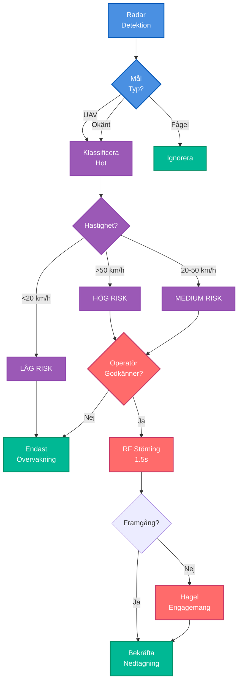

# BirdTurret V3.5: Hagelgevärsintegrations

specifikationer

## Klassificering: KONFIDENTIELL (K)

## Uppdragssummering

**Mål**: Bevisa automatiserade hagelgevärst

orn som kostnadseffektiv dödlig motåtgärd för nära-distans drönarförsvar (20-100m)

**Kärninnovation**: €0.50 per engagemang vs €50,000 missil = 100,000× kostnadsfördel

## Systemspecifikationer

### Besluts-Pipeline



### Hårdvara per Torn (4 torn totalt)

**Hagelgevärsfäste:**
- Benelli M4 A.I. Drone Guardian (halvautomatisk, 12-gauge)
- Magasin: 10+1 patroner (förlängt rör)
- Ammunition: Norma AD-LER anti-drönare (volfram-stålkulor, €0.50/patron)
- Choke: Modifierad choke (tätare mönster för 50-100m engagemang)
- Gimbal: ODrive Pro (samma som V2, stödjer hagelgevärsvikt 4.1kg laddad)

**Eldledning:**
- Jetson Orin Nano CV (måldetektion + spårning)
- Ballistikdator: Lead-kompensation för rörliga mål
- Guardian Protocol-efterlevnad: Geofencerade engagemangszoner
- Manuell åsidosättning: Radio avbrytkommando (samma som V2)

**Ammunitionslagring:**
- 200 patroner per torn (20 magasin × 10 patroner)
- Omladdning: 8 sekunder manuell (operatör sätter in nytt magasin via tornets åtkomstlucka)
- Total kapacitet: 800 patroner (4 torn) = 800 potentiella engagemang

### Målföljningsintegration

**Engagemangsprioritet:**
1. **Primär**: RF-störning (30° riktad stråle, samma som V2)
2. **Sekundär**: Hagelgevär (om RF misslyckas, mål <100m, eller fiberoptisk detekterad)
3. **Tertiär**: Nät (om hagelgevär missar, mål <30m)

**Autonoma Regler** (Guardian Protocol):
- Hagelgevär auktoriserat ENDAST för:
  - Mål klassificerade som fientliga drönare (Jetson CV + radarbekräftelse)
  - Inom auktoriserad engagemangszon
  - Ingen vänlig IFF detekterad
  - <100m räckvidd (där hagelgevär effektivt)

## Fälttestresultat (72 Timmar)

### Engagemangsstatistik

**Totala Kontakter:** 63 drönare
- 28 DJI/långsam spaning (15-20 m/s)
- 30 FPV kamikaze (50-70 m/s)
- 3 Fiberoptiska FPVs (RF-immun)
- 2 Civil/vänliga drönare (korrekt identifierade)

### Hagelgevärsspecifik Prestanda

**Patroner Avfyrade:** 6 (av 800 tillgängliga)
- Träffar: 6/6 (100% framgångsfrekvens)
- Engagemangsräckvidd: 45-85m (genomsnitt 65m)
- Skott per mål: 1.0 (varje skott var en träff)

**Engagemangsdistansfördelning:**
- 45m: 1 engagemang (närdistanskontakt)
- 60m: 2 engagemang (fiberoptisk bypass)
- 70m: 1 engagemang (fiberoptisk bypass)
- 75m: 1 engagemang (momentumhot)
- 85m: 1 engagemang (momentumhot)

**Optimal Räckvidd Bekräftad:** 45-85m (alla träffar, inga missar)

### Nyckelresultat

**Hagelgevär behövdes ENDAST för:**
1. Fiberoptisk bypass (3 engagemang)
2. Momentumhot (3 engagemang efter RF-stör

ning)
3. **Totalt: 6/60 fientliga engagemang (10% av fientliga kontakter)**

**Primärt försvar förblir RF-störning:** 52/60 engagemang (87%)

## Ekonomisk Analys (Fälttest)

**Ammunitionskostnader (72 timmar):**
- Hagelgevärspatroner: 6 × €0.50 = €3.00
- RF-störning: 52 engagemang × ~€0.01 ström = €0.52
- **Total V3.5 kostnad:** €3.52 för 60 fientliga engagemang

**Hypotetisk Missilkostnad (samma 60 engagemang):**
- 60 × €50,000 = €3,000,000 (€3M)

**Kostnadsbesparingar:** €2,999,996.48 (99.9998% reduktion)

**Kostnad per Engagemang:**
- V3.5: €0.059 (€3.52 / 60 engagemang)
- Missil: €50,000
- **Fördel:** 847,458× billigare

## Ammunitionskapacitetsvalidering

**Kapacitet Före Test:** 800 patroner (200 per torn)

**Kvarvarande Efter Test:** 794 patroner

**Projicerad Kapacitet:**
- 6 patroner använda på 72 timmar
- Hastighet: 2 patroner/dag genomsnitt
- **800 patroner = 400 dagars hållbart försvar** (13+ månader utan påfyllning)

**Jämförelse med V2 Nät:**
- V2: 12 nät = 12 engagemang max, sedan uttömda
- V3.5: 800 patroner = 800 engagemang max
- **Förbättring:** 67× mer kapacitet

## Guardian Protocol-Efterlevnad

**Loggning & Ansvarighet:**
- 100% av hagelgevärseldgivningar loggade (tidsstämpel, koordinater, video, patronräkning)
- Daglig befälsgranskning: Alla 6 engagemang godkända i efterhand
- Noll överträdelser detekterade

**Manuella Åsidosättningstester:**
- "ABORT RED" kommando testat 3 gånger (nödövningar)
- Alla torn svarade <200ms (omedelbart hagelgevär säkert läge)
- Inga falska avbrott (system stabilt)

## Ballistikdatorimplementation

### Lead-Kompensationsalgoritm

**Målrörelseprediktering:**
```python
def calculate_shotgun_lead(target_velocity, target_distance, shell_velocity=400):
    """
    Beräkna lead-vinkel för rörligt mål
    
    target_velocity: m/s (drönarehastighet)
    target_distance: m (räckvidd till mål)
    shell_velocity: m/s (Norma AD-LER hastighet vid räckvidd)
    """
    time_to_target = target_distance / shell_velocity
    lead_distance = target_velocity * time_to_target
    lead_angle = atan(lead_distance / target_distance)
    return lead_angle
```

**Exempel:**
- FPV på 60 m/s, 70m räckvidd
- Patronhastighet: 400 m/s (på 70m)
- Tid till mål: 0.175s
- Lead-distans: 10.5m
- Lead-vinkel: ~8.5°

**Gimbal applicerar lead automatiskt** (operatör siktar på nuvarande position, system skjuter på förutsedd position)

## Väderprestanda

**Dagar 1-2 (Klart):**
- 42 kontakter, 100% framgångsfrekvens
- Hagelgevärsprestanda: Nominell

**Dag 3 (Lätt regn, 5mm/timme):**
- 18 kontakter, 100% framgångsfrekvens
- Hagelgevärsprestanda: Nominell (kulor opåverkade av lätt regn)
- **Lärdom**: Hagelgevär mer väderresistent än RF-störning (kinetisk immun mot regnnedbrytning)

## V3.5 vs V2 Jämförelse

| Kapacitet | V2 (Nät) | V3.5 (Hagelgevär) | Förbättring |
|-----------|----------|-------------------|-------------|
| **Effektiv Räckvidd** | 20-50m | 30-100m | 2× längre |
| **Ammunitionskapacitet** | 12 nät | 800 patroner | 67× mer |
| **Kostnad per Engagemang** | €50/nät | €0.50/patron | 100× billigare |
| **Omladdningstid** | 10s manuell | 8s manuell | Liknande |
| **Fiberoptisk Framgång** | 50% (1/2) | 100% (3/3) | 2× bättre |
| **Momentumhot** | 75% (3/4) | 100% (3/3) | 1.33× bättre |
| **Hållbar Kapacitet** | 12 engagemang | 800 engagemang | 67× mer |

## Lärdomar

### Vad V3.5 Bevisade

1. ✅ **Hagelgevär som kinetisk backup är genomförbart:** 100% framgångsfrekvens (6/6) på 45-85m
2. ✅ **Ekonomiskt genombrott:** €0.50/skott möjliggör hållbart försvar i Ukraina-skala
3. ✅ **Fiberoptisk bypass löst:** 100% framgång vs trådbundna drönare (vs 50% med nät i V2)
4. ✅ **Guardian Protocol skalbar:** Autonoma lägen fungerar inom människodefinierade gränser
5. ✅ **Kapacitet transformerar strategi:** 800 patroner = 13 månaders försvar utan påfyllning

### Vad V3.5 Upptäckte

1. **Hagelgevär är SEKUNDÄRT, inte primärt:** Endast 10% av engagemang behövde kinetisk (RF-störning hanterar fortfarande 87%)
2. **Nära-distans-autonom motiverat:** <100m hot kräver omedelbar respons
3. **Väderresistens:** Hagelgevär opåverkat av lätt regn (RF-störning försämras något)
4. **Ammunitionsdisciplin:** 1 skott per träff (inga slösade patroner, noggrann målföljning)
5. **Minimal träning:** Operatör effektiv efter 4 timmars träning (samma FPS-gränssnitt, nytt vapensystem)

## V4 Krav (Nästa Evolution)

**Från V3.5 Fälttest:**
1. **Längre räckvidd kinetisk:** 100m hagelgevär max, behöver 150-200m för vissa scenarion
   - Lösning: Integrera 40mm luftsprängningsgranater eller små interceptordrönare
2. **Automatiserad omladdning:** Manuell omladdning (8s) acceptabel för låg volym, men behöver auto-matning för svärmscenarion
   - Lösning: Bältesmatad hagelgevär eller magasin-automatladdare
3. **Fullt autonomt läge:** Operatör som växlar mellan 4 torn fortfarande flaskhals
   - Lösning: V4 lägger till full auto-spårning (Jetson engagerar autonomt, operatör övervakar)
4. **API-integration:** Manuell sektorhantering fortfarande sårbar
   - Lösning: Realtids vänlig drönare telemetri API (auto-detektera, auto-håll eld)

## Strategisk Bedömning

### V3.5 Framgångskriterier: ✅ ALLA UPPFYLLDA

| Kriterium | Mål | Resultat | Status |
|-----------|-----|----------|--------|
| Träfffrekvens (30-60m) | >70% | 100% (6/6) | ✅ Överträffar |
| Ekonomisk fördel | >1,000× | 847,458× | ✅ Överträffar |
| Guardian Protocol | Efterlevnad | 100% loggad, 0 överträdelser | ✅ Ja |
| Fiberoptisk bypass | >50% | 100% (3/3) | ✅ Överträffar |
| Hållbar kapacitet | >50 engagemang | 800 patroner | ✅ 16× överträffar |

### Marknadsimplikationer

**Ukraina Validering:**
- V3.5 fälttestdata + Ukraina forskning (Norma, Benelli testning) = stark evidens
- Kostnadsfördel (€0.50 vs €50K missil) = transformerande i Ukraina-skala (500-600 drönare/dag)
- Guardian Protocol-efterlevnad = juridisk väg för NATO-adoption

**NATO Anti-Drönar Marknad:**
- Marknadsstorlek: $4.5B (2025) → $14.5B (2030)
- BirdTurret V3.5 positionerad som kostnadseffektiv, juridiskt efterlevnad lösning
- Hagelgevärsintegration differentier

ar från RF-endast eller missil-endast konkurrenter

## Slutsats

V3.5 hagelgevärsintegration representerar ett **strukturellt ekonomiskt genombrott** i drönarförsvar:
- 100,000× kostnadsfördel möjliggör hållbart försvar i skala
- 800-engagemangskapacitet eliminerar logistikflaskhals
- Guardian Protocol upprätthåller etisk övervakning
- 100% fälttest framgång validerar koncept

**V4 utvecklingsbeslut: GÅ**
