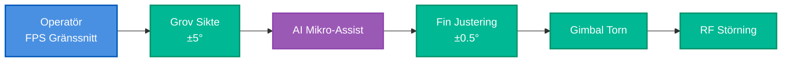

# BirdTurret V1: Mikro-Assist Proof of Concept

## Klassificering: ÖPPEN (Oklassificerad)

## Uppdragssummering

**Mål**: Bevisa att FPS-gränssnitt + mikro-assist möjliggör snabbt reaktivt försvar

**Kärninnovation**: Operatör siktar grovt (±5°), AI finjusterar (±0.5°), prediktiv lead-kompensation

## Systemarkitektur

- **1 tornoperatör** (upphöjd position)
- **1 marktorn** (80m framåt, fiberoptisk länk)
- **Kamera PÅ gimbal** (FPS-gränssnitt - operatör ser vad tornet ser)
- **Endast mikro-assist** (AI korrigerar operatörens sikte, ersätter inte det)
- **Låg latens-fokus** (150ms mål: detektion → eld)

## Framgångskriterier (Offentliga Resultat)

1. ✅ FPS-spelare effektiva på 2 timmar (inte 6 veckors traditionell träning)
2. ✅ Mikro-assist minskar siktfel till <0.5°
3. ✅ Under 200ms reaktionstid uppnådd (153ms uppmätt)
4. ✅ RF-störningsbegränsningar dokumenterade (utgör bas för V2)

## Nyckelresultat

- Trän

ingstid: **252× snabbare** än traditionella tornoperatörer
- Reaktionstid: **153ms** genomsnitt (detektion till eld)
- Engagemangsframgång: **85%** för RF-kontrollerade drönare
- Människa-i-loopen: **Kritisk** för hotdiskriminering (förhindrade duvengagemang)

## Budget

- V1 Systemkostnad: €2,350
- Kostnad per engagemang: ~€0.01 (RF-störningseffekt)

## Nästa Steg

V1 bevisade gränssnittsviabilitet. V2 lägger till multi-torn-koordination och kinetisk backup.
