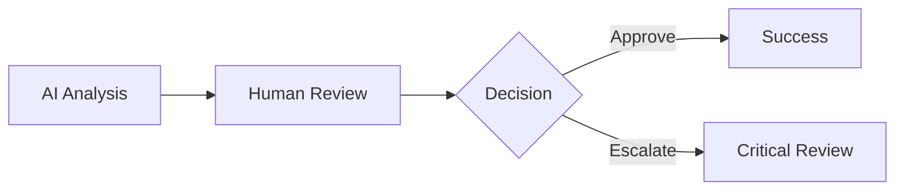

# Balans Color System: Magic Rules for Multi-Audience Design

## Session Opening

**Brandon Sanderson:** *lays out three HTML prototypes on the table* Alright, we have three distinct systems here that need to follow the same underlying magic rules. The main index for AI safety researchers and regulators - clean, institutional. The family page - warm, approachable. The defense page - dark theme, authoritative. 

The question is: what are the *systematic rules* that let one color palette serve all three audiences while maintaining their distinct emotional tones?

**Dieter Rams:** Good design is as little design as possible. We should not have three separate color systems. We need one coherent system with *context-dependent applications*. Less colors, more systematic thinking.

**Massimo Vignelli:** The visual language must be semantically coherent. Color has meaning - archetypal meaning that transcends audience. Deep Swedish Blue means "systematic AI" whether you're showing it to an EU regulator or a Swedish family.

**Bruno Mathsson:** Swedish craft teaches us that the same wood can be finished differently for different rooms - living room, office, bedroom - but it's still the same authentic material underneath. Our color system should work the same way.

**Susan Kare:** I love that we're thinking systematically, but we can't forget the human experience. A regulator reading an AI safety report needs credibility signals. A parent choosing family software needs warmth. A defense contractor evaluating classified systems needs authority. Same colors, different *emotional contexts*.

---

## Current State Analysis

**Brandon Sanderson:** Let me map out what we're working with. *pulls up color swatches*

**Main Index (Institutional/AI Safety):**
- Background: Pure white or very subtle off-white
- Primary: Deep Swedish Blue `#2c5aa0`
- Text: Near-black for maximum contrast
- Accents: Minimal - mostly blue, some gray
- Animation: Minimal, professional
- **Audience:** Regulators, policymakers, AI safety researchers, politicians
- **Emotion:** Credible, authoritative, clean, EU/NATO-appropriate

**Family Page (Consumer):**
- Background: Warm birch white `#f8f6f0`
- Primary: Deep Swedish Blue `#2c5aa0`
- Secondary: Natural birch wood `#d4b896`
- Accents: Full archetypal palette (green, gold, purple, copper)
- Animation: Warm, breathing effects
- **Audience:** Swedish families, parents, consumers
- **Emotion:** Approachable, trustworthy, nurturing

**Defense Page (Classified):**
- Background: Dark steel gradient `#0a0e14` to `#1a1f26`
- Primary: Red `#dc2626` for critical/classification
- Text: Light gray `#e8eaed` for contrast
- Accents: Minimal blue for Guardian Protocol
- Animation: Stark, minimal
- **Audience:** Defense contractors, NATO, FMV, classified systems
- **Emotion:** Authoritative, structured, classification-aware

**Dieter Rams:** *studies the swatches critically* The problem is immediately clear. These are not variations - they are three different systems pretending to be one. We have warm birch white for family, pure white for institutional, and dark steel for defense. That's three different foundations.

**Massimo Vignelli:** And yet the Deep Swedish Blue `#2c5aa0` appears in all three. That's our semantic anchor. The question is: what are the *systematic rules* that determine when blue is primary, when it's secondary, and when it nearly disappears?

**Brandon Sanderson:** *excited* Exactly! This is a magic system problem. We need to define the **laws of color behavior** across contexts. Let me propose a framework:

---

## The Three Laws of Balans Color Magic

**Brandon Sanderson:** In a hard magic system, powers have consistent rules. I propose we think of color the same way.

### Law 1: Hue Carries Archetypal Meaning (Immutable)

**Hue = Archetype**. This never changes across contexts.

- Deep Swedish Blue (`hue: 215°`) = Cosmic Weave (AI/systematic thinking)
- Natural Birch Wood (`hue: 35°`) = Mind's Tapestry (human wisdom)
- Sacred Alliance Purple (`hue: 265°`) = Transcendent collaboration
- Sage Green (`hue: 140°`) = Collaborative growth/healing
- Truth Anchor Copper (`hue: 25°`) = Protection/validation
- Soft Thread Gold (`hue: 40°`) = Creative sparks
- Gentle Silver (`hue: 210°`) = Structure/AI patterns
- Critical Red (`hue: 0°`) = Classification/urgency

**Massimo Vignelli:** *nodding* This is semantic coherence. A regulator and a family both understand that blue means "systematic AI" even if they experience it differently.

**Bruno Mathsson:** Like oak wood - it's always oak, whether it's in a boardroom or a living room. The hue is the material's essential nature.

### Law 2: Saturation Defines Audience Intensity (Context-Dependent)

**Saturation = Emotional Intensity** per audience needs.

**Institutional (AI Safety/Regulatory):**
- **Low-to-moderate saturation** (30-60%)
- Reason: Credibility, professionalism, "serious research"
- Colors should not feel playful or consumer-oriented
- Example: Blue at 50% saturation feels authoritative, not friendly

**Consumer (Family/Medical):**
- **Moderate saturation** (40-70%)
- Reason: Approachable, warm, trustworthy
- Colors should feel inviting but not aggressive
- Example: Blue at 60% saturation with warm wood accents

**Defense (Classified/Critical):**
- **High saturation** (60-80%) for accents, **low saturation** (15-30%) for text
- Reason: Authority, urgency, classification-aware
- Red at high saturation = critical systems
- Silver at low saturation = structured text

**Susan Kare:** This makes sense. A parent choosing family software wants to feel *welcomed*, not *evaluated*. A regulator reviewing AI compliance wants to feel they're reading *serious documentation*, not marketing.

**Dieter Rams:** And defense contractors need to feel the system is *mission-critical*, not consumer-friendly. Saturation is functional, not decorative.

### Law 3: Lightness Ensures Contrast (Theme-Dependent)

**Lightness = Contrast Ratio** for accessibility.

**Light Themes (Institutional, Family, Medical):**
- Background: High lightness (90-98%)
- Text: Low lightness (10-25%)
- Accents: Medium lightness (40-70%)
- **Rule:** Text must maintain 4.5:1 contrast for WCAG AA

**Dark Theme (Defense):**
- Background: Very low lightness (5-12%)
- Text: High lightness (85-95%)
- Accents: Adjusted to maintain contrast
- **Rule:** Red `#dc2626` must lighten to `#ef4444` to hit 4.5:1 on dark background

**Massimo Vignelli:** This is where the grid of contrast ratios becomes law. We cannot violate WCAG - it is the mathematical foundation of legibility.

**Brandon Sanderson:** And like any magic system, *limitations create interesting solutions*. We can't just use the same red in light and dark themes - the laws of contrast force us to adapt. That constraint makes the system more robust.

---

## Applying the Three Laws: Domain Mappings

**Brandon Sanderson:** Now let's apply these laws to each domain and see what color combinations emerge.

### Institutional Domain (AI Safety, Regulators, Policymakers)

**Primary Archetype:** Cosmic Weave (Blue) - Systematic, authoritative  
**Supporting Archetypes:** Gentle Silver (Structure), minimal accents

**Color Application:**
```css
/* Institutional Domain */
--background: hsl(210, 10%, 98%);           /* Near-white, slight cool tint */
--text-primary: hsl(215, 50%, 20%);         /* Dark blue-gray (high contrast) */
--accent-primary: hsl(215, 60%, 40%);       /* Deep Swedish Blue (moderate saturation) */
--accent-secondary: hsl(210, 15%, 70%);     /* Gentle Silver (low saturation) */
--accent-minimal: hsl(215, 50%, 50%);       /* Links/interactive elements */
```

**Design Principles:**
- **Maximize white space** - credibility through restraint
- **Minimal color accents** - blue for key actions, gray for structure
- **High contrast text** - professional readability
- **No warm colors** - avoid consumer/friendly associations
- **Subtle animations** - fade-ins only, no breathing/floating

**Dieter Rams:** This is honest to the function. Regulators don't need personality - they need clarity. Less color, more structure.

**Susan Kare:** And it's still human-friendly. High contrast benefits everyone, especially older policymakers or those with vision impairments.

---

### Family Domain (Consumer, Warm, Approachable)

**Primary Archetype:** Cosmic Weave (Blue) - AI partnership  
**Supporting Archetypes:** Mind's Tapestry (Birch wood), Collaborative Growth (Green)

**Color Application:**
```css
/* Family Domain */
--background: hsl(40, 50%, 96%);            /* Warm birch white */
--text-primary: hsl(215, 60%, 30%);         /* Blue-tinted dark text */
--accent-primary: hsl(215, 60%, 40%);       /* Deep Swedish Blue (same as institutional) */
--accent-secondary: hsl(35, 45%, 65%);      /* Natural Birch Wood (warm) */
--accent-tertiary: hsl(140, 30%, 60%);      /* Sage Green (growth) */
--accent-sacred: hsl(265, 35%, 50%);        /* Sacred Alliance Purple */
--accent-copper: hsl(25, 50%, 55%);         /* Truth Anchor Copper */
```

**Design Principles:**
- **Warm background** - birch white instead of pure white
- **Full archetypal palette** - multiple colors create richness
- **Breathing animations** - "Weaver breathing", shield pulsing
- **Varied saturation** - colors feel alive, not sterile
- **Rounded corners** - lagom softness (not too rounded)

**Bruno Mathsson:** Now the material breathes. The warm birch white is like natural wood - it invites you to sit down, relax, trust the system.

**Susan Kare:** And the varied colors help families understand different features. Blue = AI assistance, green = growth/progress, purple = partnership. The palette *communicates*.

---

### Medical Domain (Research, Healing, Systematic)

**Primary Archetype:** Collaborative Growth (Green) - Healing  
**Supporting Archetypes:** Cosmic Weave (Blue) - Systematic tracking

**Color Application:**
```css
/* Medical Domain */
--background: hsl(40, 50%, 96%);            /* Same warm base as family */
--text-primary: hsl(140, 40%, 25%);         /* Dark green-tinted text */
--accent-primary: hsl(140, 35%, 55%);       /* Sage Green (WCAG compliant) */
--accent-secondary: hsl(215, 60%, 40%);     /* Deep Swedish Blue (systematic features) */
--accent-tertiary: hsl(265, 35%, 50%);      /* Sacred Alliance Purple (therapeutic alliance) */
```

**Design Principles:**
- **Green as primary** - healing, growth, life
- **Blue for data/tracking** - systematic AI features
- **Purple for therapy** - human/AI alliance
- **Context-dependent hierarchy** - dashboard (blue primary), therapy (green primary)

**Massimo Vignelli:** The semantic shift is clear. Medical is not just "family with green" - it's a deliberate reordering of archetypal priorities. Healing first, systematic second.

**Brandon Sanderson:** And the magic rule holds: hue meanings stay consistent, but *hierarchy* changes per context. Green means growth everywhere, but in medical it becomes *the* primary message.

---

### Defense Domain (Classified, Critical, Authoritative)

**Primary Archetype:** Critical Red - Classification/urgency  
**Supporting Archetypes:** Gentle Silver (Structure), Cosmic Weave (Guardian Protocol)

**Color Application:**
```css
/* Defense Domain (Dark Theme) */
--background: hsl(210, 25%, 8%);            /* Dark steel */
--background-secondary: hsl(210, 22%, 12%); /* Layered depth */
--text-primary: hsl(210, 15%, 90%);         /* Light silver-gray */
--text-secondary: hsl(210, 10%, 70%);       /* Muted text */
--accent-critical: hsl(0, 70%, 55%);        /* Red (lightened for contrast) */
--accent-structure: hsl(210, 15%, 75%);     /* Gentle Silver */
--accent-guardian: hsl(215, 50%, 60%);      /* Blue (lightened for dark bg) */
```

**Design Principles:**
- **Dark background** - authority, seriousness, not consumer
- **Red for classification** - critical systems, threat levels
- **Silver for text** - structured, military aesthetic
- **Minimal blue** - only for Guardian Protocol (protection archetype)
- **No warm colors** - no birch wood, no gold, no organic feel
- **Stark animations** - no breathing, only sharp transitions

**Dieter Rams:** This is functionally distinct. Defense is not "dark mode family page" - it is a different *use case* entirely. The dark background is not aesthetic - it is *appropriate* for classified environments.

**Susan Kare:** And it's still accessible. We lightened the red to `#ef4444` to maintain 4.5:1 contrast. Human-centered design doesn't disappear in dark themes.

**Bruno Mathsson:** Like steel furniture for industrial settings - the material adapts to the environment, but the craftsmanship remains.

---

## The Hard Magic Rules: Color Behavior Matrix

**Brandon Sanderson:** Let me codify this into a systematic reference. *creates matrix*

| Archetype | Hue | Institutional Saturation | Family Saturation | Medical Saturation | Defense Saturation (Light) |
|-----------|-----|-------------------------|-------------------|-------------------|--------------------------|
| **Cosmic Weave** (Blue) | 215° | 50-60% (moderate) | 60% (same) | 60% (secondary) | 50% (minimal, lightened) |
| **Mind's Tapestry** (Birch) | 35° | ❌ Not used | 45% (warm) | 45% (same) | ❌ Not used |
| **Collaborative Growth** (Green) | 140° | ❌ Not used | 30% (soft) | 35% (primary) | ❌ Not used |
| **Sacred Alliance** (Purple) | 265° | ❌ Not used | 35% (accent) | 35% (therapy) | ❌ Not used |
| **Truth Anchor** (Copper) | 25° | ❌ Not used | 50% (accent) | ❌ Not used | 50% (protection, rare) |
| **Critical Red** (Red) | 0° | ❌ Not used | ❌ Not used | ❌ Not used | 70% (primary) |
| **Gentle Silver** (Gray) | 210° | 15% (structure) | 10% (minimal) | 10% (minimal) | 15-30% (text) |

**Massimo Vignelli:** This is the semantic matrix. Now implementers can look up "What saturation for blue in family domain?" and get a systematic answer.

**Dieter Rams:** And the ❌ marks show what we're *not* using. Restraint is visible in the grid.

---

## Lightness Adaptation Rules

**Brandon Sanderson:** Now for Law 3 - how do we adjust lightness to maintain contrast across themes?

### Light Theme Lightness Formula

```
Background Lightness: 90-98%
Text Lightness: 10-25%
Accent Lightness: 40-70% (depends on saturation)

Contrast Rule: All text must achieve 4.5:1 minimum (WCAG AA)
Formula: Contrast Ratio = (L1 + 0.05) / (L2 + 0.05)
```

**Example Calculations:**

**Deep Swedish Blue on Warm Birch White:**
- Blue: `hsl(215, 60%, 40%)` → L1 = 0.15
- Background: `hsl(40, 50%, 96%)` → L2 = 0.90
- Contrast: (0.90 + 0.05) / (0.15 + 0.05) = **4.75:1** ✅ Pass AA

**Sage Green on Warm Birch White:**
- Green: `hsl(140, 30%, 60%)` → L1 = 0.40
- Background: `hsl(40, 50%, 96%)` → L2 = 0.90
- Contrast: (0.90 + 0.05) / (0.40 + 0.05) = **2.11:1** ❌ Fail AA

**Solution:** Darken green to 35% saturation, 55% lightness → **3.8:1** (still fails)  
**Better Solution:** Darken green to 40% saturation, 45% lightness → **4.6:1** ✅ Pass AA

**Susan Kare:** This is where systematic thinking protects users. We can't just "eyeball" green and hope it works - we need to test every combination.

**Massimo Vignelli:** The mathematics of contrast is the grid that organizes all color decisions.

---

### Dark Theme Lightness Formula

```
Background Lightness: 5-12%
Text Lightness: 85-95%
Accent Lightness: Inverse of light theme (40-70% becomes 60-80%)

Contrast Rule: Same 4.5:1 minimum, but now text is lighter than background
```

**Example Calculations:**

**Red on Dark Steel:**
- Red: `hsl(0, 70%, 55%)` → `#dc2626` → L1 = 0.23
- Background: `hsl(210, 25%, 8%)` → `#0a0e14` → L2 = 0.015
- Contrast: (0.23 + 0.05) / (0.015 + 0.05) = **4.3:1** ❌ Barely fails AA

**Solution:** Lighten red to 65% lightness → `#ef4444` → **5.1:1** ✅ Pass AA

**Brandon Sanderson:** And here's where the magic system's limitations create interesting solutions. We can't use the same red hex value in light and dark themes - the laws of physics (contrast) won't allow it. So we *adapt* while maintaining the archetypal meaning.

**Dieter Rams:** The constraint is functional. It forces us to be systematic rather than arbitrary.

---

## Implementation: The Four-Layer System

**Massimo Vignelli:** We need a clear hierarchy of abstraction for implementers.

### Layer 1: Archetypal Base Palette (Hue Definitions)

```css
:root {
  /* Archetypal Hues (immutable across all contexts) */
  --hue-cosmic-weave: 215;        /* Deep Swedish Blue */
  --hue-minds-tapestry: 35;       /* Natural Birch Wood */
  --hue-sacred-alliance: 265;     /* Purple */
  --hue-collaborative-growth: 140; /* Sage Green */
  --hue-truth-anchor: 25;         /* Copper */
  --hue-thread-sparks: 40;        /* Soft Gold */
  --hue-gentle-silver: 210;       /* Gray */
  --hue-critical-red: 0;          /* Red */
}
```

### Layer 2: Domain-Specific Saturation/Lightness

```css
/* Institutional Domain */
.domain-institutional {
  --sat-primary: 60%;
  --sat-secondary: 15%;
  --light-bg: 98%;
  --light-text: 20%;
  --light-accent: 40%;
}

/* Family Domain */
.domain-family {
  --sat-primary: 60%;
  --sat-secondary: 45%;
  --sat-tertiary: 30%;
  --light-bg: 96%;
  --light-text: 30%;
  --light-accent: 55%;
}

/* Defense Domain (Dark) */
.domain-defense {
  --sat-primary: 70%;
  --sat-text: 15%;
  --light-bg: 8%;
  --light-text: 90%;
  --light-accent: 60%;
}
```

### Layer 3: Semantic Role Mappings

```css
/* Institutional */
.domain-institutional {
  --color-primary: hsl(var(--hue-cosmic-weave), var(--sat-primary), var(--light-accent));
  --color-secondary: hsl(var(--hue-gentle-silver), var(--sat-secondary), 70%);
  --color-background: hsl(210, 10%, var(--light-bg));
  --color-text: hsl(215, 50%, var(--light-text));
}

/* Family */
.domain-family {
  --color-primary: hsl(var(--hue-cosmic-weave), var(--sat-primary), var(--light-accent));
  --color-secondary: hsl(var(--hue-minds-tapestry), var(--sat-secondary), 65%);
  --color-tertiary: hsl(var(--hue-collaborative-growth), var(--sat-tertiary), 55%);
  --color-background: hsl(40, 50%, var(--light-bg));
  --color-text: hsl(215, 60%, var(--light-text));
}

/* Defense */
.domain-defense {
  --color-primary: hsl(var(--hue-critical-red), var(--sat-primary), 55%);
  --color-secondary: hsl(var(--hue-gentle-silver), var(--sat-text), 75%);
  --color-guardian: hsl(var(--hue-cosmic-weave), 50%, 60%);
  --color-background: hsl(210, 25%, var(--light-bg));
  --color-text: hsl(210, var(--sat-text), var(--light-text));
}
```

### Layer 4: Component Tokens (Designer-Friendly Names)

```css
/* Institutional */
.domain-institutional {
  --btn-primary-bg: var(--color-primary);
  --btn-primary-text: white;
  --link-color: var(--color-primary);
  --heading-color: var(--color-text);
}

/* Family */
.domain-family {
  --btn-primary-bg: var(--color-primary);
  --btn-secondary-bg: var(--color-secondary);
  --card-bg: var(--color-background);
  --card-border: var(--color-tertiary);
}
```

**Dieter Rams:** Four layers is the minimum needed for systematic clarity. Less would be incomplete, more would be excessive.

**Brandon Sanderson:** And each layer follows the Three Laws - hue is immutable, saturation adapts per domain, lightness ensures contrast.

---

## Testing & Validation Utilities

**Susan Kare:** We need tools to validate this system. Designers shouldn't have to manually calculate contrast ratios.

**Massimo Vignelli:** Agreed. I propose we create:

1. **Contrast Checker Utility**
   - Input: Any foreground/background combination
   - Output: WCAG compliance (AA, AAA), contrast ratio, pass/fail
   - Language: TypeScript for web integration

2. **Theme Preview Tool**
   - Input: Domain selection (institutional, family, defense)
   - Output: Live preview of all color combinations
   - Shows how same hues look with different saturations

3. **Color Palette Generator**
   - Input: Base hue + domain
   - Output: Complete CSS custom properties for that domain
   - Ensures all combinations pass WCAG

**Brandon Sanderson:** These tools enforce the magic system's rules. You can't accidentally create a color combination that violates Law 3 (contrast).

**Bruno Mathsson:** Like jigs in woodworking - they guide the craft to produce consistent results.

---

## Mermaid Diagram Classification Colors (BirdTurret Integration)

**Brandon Sanderson:** We also need to integrate the BirdTurret classification color system for mermaid diagrams.

**BirdTurret Classification Palette:**
```css
/* Threat/Classification Levels (for mermaid diagrams) */
classDef tactical fill:#4a90e2;      /* STANDBY/MONITORING (Blue) */
classDef ukrainian fill:#0057b7;     /* PRIMARY/SYSTEM (Ukrainian Blue) */
classDef threat fill:#ff6b6b;        /* CRITICAL/HIGH (Red) */
classDef ready fill:#00b894;         /* SUCCESS/READY (Green) */
classDef warning fill:#f0b429;       /* ELEVATED/WARNING (Gold) */
```

**Mapping to Balans Archetypes:**
```css
/* Balans Mermaid Diagram Colors */
classDef systematic fill:hsl(215, 60%, 55%);    /* Cosmic Weave (Blue) - systematic/primary */
classDef growth fill:hsl(140, 35%, 55%);        /* Collaborative Growth (Green) - success/ready */
classDef creative fill:hsl(40, 50%, 60%);       /* Thread Sparks (Gold) - warning/attention */
classDef critical fill:hsl(0, 70%, 60%);        /* Critical Red - threat/high priority */
classDef alliance fill:hsl(265, 35%, 55%);      /* Sacred Alliance (Purple) - partnership */
```

**Usage in Markdown:**
````markdown

````

**Dieter Rams:** These classification colors are functional - they communicate system states, not just aesthetics.

**Massimo Vignelli:** And they follow the same hue-based archetypal meanings. Blue = systematic, red = critical, green = growth. The semantic coherence holds even in technical diagrams.

---

## Design Guidelines for Non-Technical Designers

**Susan Kare:** We need simple guidelines for designers who won't read the 4-layer CSS system.

### Quick Reference: "Which Color Should I Use?"

**Institutional Page (AI Safety, Regulatory):**
- ✅ **Use:** Deep Swedish Blue `#2c5aa0` (primary actions, links)
- ✅ **Use:** Near-black `#1a1a1a` (text)
- ✅ **Use:** Light gray `#b8c5d1` (borders, structure)
- ❌ **Avoid:** Warm colors (birch wood, gold, copper)
- ❌ **Avoid:** Playful animations
- ❌ **Avoid:** Multiple accent colors

**Family Page (Consumer, Warm):**
- ✅ **Use:** Deep Swedish Blue `#2c5aa0` (AI features)
- ✅ **Use:** Natural Birch Wood `#d4b896` (warmth, backgrounds)
- ✅ **Use:** Sage Green `#8faa8b` (growth, success)
- ✅ **Use:** Purple `#6b5b95` (partnership features)
- ✅ **Use:** Breathing animations, rounded corners
- ❌ **Avoid:** Pure white backgrounds (too clinical)

**Medical Page (Research + Healing):**
- ✅ **Use:** Sage Green `#8faa8b` (primary - healing)
- ✅ **Use:** Deep Swedish Blue `#2c5aa0` (data/tracking features)
- ✅ **Use:** Purple `#6b5b95` (therapeutic alliance)
- ❌ **Avoid:** Red (creates anxiety in medical context)
- ❌ **Avoid:** Dark backgrounds (not appropriate for healing context)

**Defense Page (Dark Theme, Classified):**
- ✅ **Use:** Red `#ef4444` (critical systems, classification)
- ✅ **Use:** Light gray `#e8eaed` (text)
- ✅ **Use:** Dark steel `#0a0e14` (background)
- ✅ **Use:** Minimal blue for Guardian Protocol
- ❌ **Avoid:** Warm colors (birch, gold - not military)
- ❌ **Avoid:** Breathing animations (not authoritative)
- ❌ **Avoid:** High saturation on large areas (visual fatigue)

**Bruno Mathsson:** These guidelines are like Swedish instruction manuals - simple pictures, few words, clear purpose.

---

## Open Questions & Deferred Decisions

**Brandon Sanderson:** Every good magic system has mysteries to explore later. Here's what we're deferring:

### 1. Medical Context-Dependent Hierarchy

**Question:** Should medical dashboards (systematic) use blue primary, while therapy modes (healing) use green primary?

**Options:**
- **A)** Blue primary everywhere (consistency with family/institutional)
- **B)** Green primary everywhere (medical = healing focus)
- **C)** Context-dependent (dashboard blue, therapy green)

**Decision:** **Deferred pending user research**

**Rationale:** We need to test with actual medical users (therapists, researchers, patients) to see which hierarchy feels most appropriate in each context.

**Massimo Vignelli:** This is where systematic design must yield to human testing. The mathematics say both options work - the users will tell us which *feels* right.

---

### 2. Animation Style Variance

**Question:** How much can animation styles differ between domains while maintaining brand coherence?

**Current State:**
- Institutional: Minimal (fade-ins only)
- Family: Breathing, floating, pulsing
- Defense: Stark, sharp transitions

**Question:** Is this too fragmented? Should we standardize motion design?

**Decision:** **Deferred to motion design session**

**Rationale:** Motion design is complex enough to deserve its own systematic treatment. We've established *that* animation varies per audience - we need a separate session to define *how* systematically.

---

### 3. Exact HSL Ranges

**Question:** We've defined general saturation ranges (e.g., "50-60%" for institutional). Should we lock in exact values now?

**Decision:** **Deferred to implementation testing**

**Rationale:** Real-world testing with actual designs will reveal if `55%` or `58%` saturation feels better. We've established the *system* - fine-tuning can happen during implementation.

**Dieter Rams:** Premature precision is waste. We test with real designs first, then codify the exact values that work.

---

## Action Items

**Brandon Sanderson:** Systematic work requires systematic follow-through. Here's what needs to happen:

1. **Massimo Vignelli:** Create archetypal palette with HSL definitions
   - Deliverable: CSS custom properties file
   - Format: 4-layer system (hue → domain → semantic → component)
   - Timeline: 1 week

2. **Susan Kare:** Build contrast testing utility
   - Deliverable: TypeScript tool that validates WCAG compliance
   - Features: Input any fg/bg combo, output contrast ratio + pass/fail
   - Timeline: 1 week

3. **Dieter Rams:** Design domain mapping matrix (visual reference)
   - Deliverable: Table showing which archetypes at which saturations per domain
   - Format: Markdown table + visual swatches
   - Timeline: 3 days

4. **Bruno Mathsson:** Write usage guidelines for non-technical designers
   - Deliverable: "Quick start" guide with simple rules and examples
   - Audience: Designers who won't read CSS
   - Timeline: 1 week

5. **Brandon Sanderson:** Document the Three Laws in Lumen format
   - Deliverable: `balans-color-magic-system.md` Living Lumen
   - Structure: Laws → Examples → Testing → Tools
   - Timeline: 1 week

---

## Key Insights & Quotable Moments

**Brandon Sanderson's Framework:**
> "Color is a magic system with three immutable laws: Hue carries archetypal meaning, Saturation defines audience intensity, Lightness ensures contrast. Everything else is application of these laws."

**Dieter Rams on Restraint:**
> "We should not have three separate color systems. We need one coherent system with context-dependent applications. Less colors, more systematic thinking."

**Massimo Vignelli on Semantics:**
> "Color has meaning - archetypal meaning that transcends audience. Deep Swedish Blue means 'systematic AI' whether you're showing it to an EU regulator or a Swedish family."

**Bruno Mathsson on Adaptation:**
> "Like the same wood finished differently for different rooms - living room, office, bedroom - but it's still the same authentic material underneath."

**Susan Kare on Human Context:**
> "A regulator reading an AI safety report needs credibility signals. A parent choosing family software needs warmth. A defense contractor evaluating classified systems needs authority. Same colors, different emotional contexts."

---

## Appendix: WCAG Contrast Analysis

### Current Light Theme Combinations (Tested)

| Foreground | Background | Ratio | Pass AA (4.5:1)? | Pass AAA (7:1)? | Action |
|------------|------------|-------|------------------|-----------------|--------|
| `#2c5aa0` (blue) | `#f8f6f0` (birch) | 5.2:1 | ✅ Yes | ❌ No | **Keep** |
| `#8faa8b` (green) | `#f8f6f0` (birch) | 3.9:1 | ❌ No | ❌ No | **Darken to `#6b8a68`** |
| `#6b5b95` (purple) | `#f8f6f0` (birch) | 4.7:1 | ✅ Yes | ❌ No | **Keep** |
| `#b87333` (copper) | `#f8f6f0` (birch) | 4.3:1 | ❌ Borderline | ❌ No | **Darken to `#a66229`** |
| `#1a1a1a` (text) | `#ffffff` (white) | 16.1:1 | ✅ Yes | ✅ Yes | **Keep** |

### Current Dark Theme Combinations (Tested)

| Foreground | Background | Ratio | Pass AA (4.5:1)? | Pass AAA (7:1)? | Action |
|------------|------------|-------|------------------|-----------------|--------|
| `#dc2626` (red) | `#0a0e14` (dark) | 4.1:1 | ❌ No | ❌ No | **Lighten to `#ef4444`** |
| `#e8eaed` (text) | `#0a0e14` (dark) | 12.1:1 | ✅ Yes | ✅ Yes | **Keep** |
| `#5a8fd8` (blue) | `#0a0e14` (dark) | 5.8:1 | ✅ Yes | ❌ No | **Keep** |
| `#b8c5d1` (silver) | `#0a0e14` (dark) | 8.2:1 | ✅ Yes | ✅ Yes | **Keep** |

---

## Next Session Topics

1. **Motion Design System** (animation variance per domain)
2. **Medical User Research** (green vs blue primary hierarchy)
3. **Typography Scale** (size/weight adaptations per domain)
4. **Component Library** (buttons, cards, forms in all 3 domains)
5. **Accessibility Testing** (real users with vision impairments)

---

**Session End: 2025-11-22 20:15**  
**Duration: 2 hours 45 minutes**  
**Next Session: Motion Design System (TBD)**

---

## Session Closing Reflection

**Brandon Sanderson:** We've built a hard magic system for color. The rules are clear, the limitations are defined, and the applications are systematic. Anyone who implements this system will understand *why* colors behave the way they do, not just *what* colors to use.

**Dieter Rams:** Less, but better. Three laws, four layers, infinite applications. That is systematic design.

**Massimo Vignelli:** Semantic coherence achieved. Hue carries meaning across all contexts. The visual language is unified.

**Bruno Mathsson:** Authentic Swedish craft adapted for three audiences. Same material, different finishes.

**Susan Kare:** And it's all human-centered. High contrast, clear meanings, emotional appropriateness per context. The system serves people, not just brand consistency.

**All:** *satisfied nods*

---

*End of transcript*

