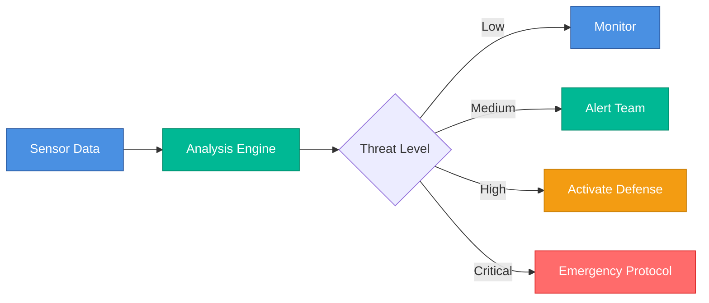
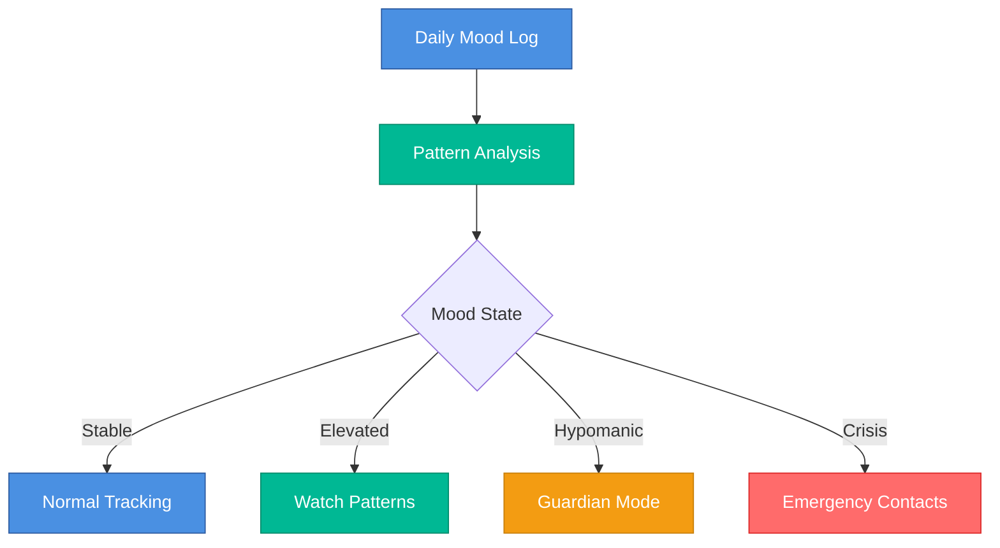
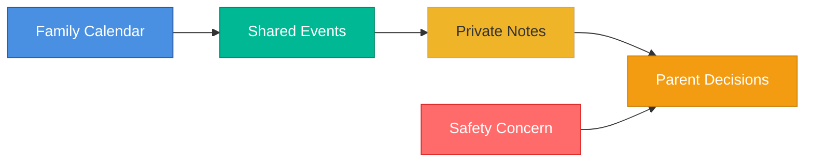

# Universal Semantic Classification: Beyond Defense

## Session Opening: The Pattern Recognition

**Sam:** I was looking at the BirdTurret design system - the dark mode dashboard with classification colors. They use color to indicate information sensitivity: UNCLASSIFIED (blue), CONFIDENTIAL (yellow), SECRET (red). 

And I realized: **all our domains handle sensitive information**. Not just defense.

**Bruce Schneier:** *leans forward* Information classification is a security fundamental. But most people think it only applies to military/government. That's a dangerous misconception.

**Edward Tufte:** Color as semantic encoding. BirdTurret uses hue to indicate information hierarchy. This is excellent information design - the visual system maps directly to the conceptual system.

**Brandon Sanderson:** This feels like discovering a universal law we can apply across our magic system. If BirdTurret proves color-coded classification works for defense, can we use the same *pattern* (not same colors) for medical, family, institutional?

**Susan Kare:** I love this. Humans are good at pattern recognition. If we teach them "yellow = caution" in one domain, they'll recognize it in another.

**Dieter Rams:** Good design is systematic design. If classification is needed everywhere, the system should be universal.

---

## Domains That Handle Sensitive Information

**Sam:** Let me enumerate all the sensitivity contexts:

### 1. Defense Domain (Already Has Classification)

**Information types:**
- UNCLASSIFIED (public)
- CONFIDENTIAL (restricted)
- SECRET (classified)
- TOP SECRET (highly classified)

**Current BirdTurret colors:**
- Tactical Blue `#4a90e2` - STANDBY/MONITORING
- Ukrainian Blue `#0057b7` - PRIMARY/SYSTEM
- Threat Red `#ff6b6b` - CRITICAL/HIGH
- Ready Green `#00b894` - SUCCESS/READY
- Warning Gold `#f0b429` - ELEVATED/WARNING

**Bruce Schneier:** NATO uses similar schemes. This is well-established in security design.

---

### 2. Medical Domain (Privacy Levels)

**Information types:**
- **Personal health data** - Who can see medication details?
- **Therapy notes** - Private vs shared with family
- **Mood logs** - Individual vs aggregate data
- **Guardian plans** - Who set the plan? Who can override?

**Sensitivity levels:**
- **Public** - Aggregated, anonymized health trends
- **Family-shared** - Mood trends shared with parents
- **Personal-private** - Detailed medication logs, therapy notes
- **Guardian-locked** - Plans set in stable state, can't be changed in altered state

**Susan Kare:** This is brilliant. Medical isn't just "is it private?" - it's "who has access at what granularity?"

**Edward Tufte:** And the stakes are high. Sharing too much could violate privacy. Sharing too little could prevent crisis intervention.

---

### 3. Family Domain (Boundary Management)

**Information types:**
- **Parent-only** - Financial decisions, relationship discussions
- **Teen-private** - Personal journals, friend conversations
- **Child-protected** - Content filtering for younger kids
- **Shared-family** - Vacation plans, household rules

**Sensitivity levels:**
- **Public** - Family calendar shared with grandparents
- **Family-internal** - Household rules, not for external sharing
- **Parent-level** - Adult decisions, not for kids
- **Individual-private** - Personal notes, not even for family

**Brandon Sanderson:** Family boundaries are *social* classification, not legal. But they're just as important for trust.

---

### 4. Institutional Domain (Research Provenance)

**Information types:**
- **Published research** - Public, citable
- **Pre-publication** - Under peer review, embargoed
- **Proprietary methods** - Company IP, competitive advantage
- **Preliminary results** - Not ready for external sharing

**Sensitivity levels:**
- **Public** - Published papers, open research
- **Academic-internal** - Shared with collaborators
- **Under-review** - Submitted but not yet published
- **Proprietary** - Trade secrets, patents pending

**Edward Tufte:** Academia has implicit classification, but rarely makes it visual. This could improve research communication.

---

## The Universal Pattern: Five-Level Hierarchy

**Bruce Schneier:** I propose we standardize on a five-level sensitivity hierarchy that maps across all domains:

### Level 0: Public (Unrestricted)
- **Defense:** UNCLASSIFIED
- **Medical:** Anonymized health statistics
- **Family:** Shared calendar events
- **Institutional:** Published research

**Color:** Blue (trust, openness, systematic)
**Icon:** Open book 📖
**Access:** Anyone

---

### Level 1: Internal (Restricted to group)
- **Defense:** CONFIDENTIAL
- **Medical:** Family-shared mood trends
- **Family:** Household decisions
- **Institutional:** Collaborative research

**Color:** Green (growth, collaboration, shared)
**Icon:** Group 👥
**Access:** Defined group (family, team, collaborators)

---

### Level 2: Private (Individual only)
- **Defense:** SECRET
- **Medical:** Personal health records
- **Family:** Individual journals
- **Institutional:** Proprietary methods

**Color:** Yellow/Gold (caution, personal boundary)
**Icon:** Lock 🔒
**Access:** Individual owner + explicitly granted

---

### Level 3: Protected (System-enforced)
- **Defense:** TOP SECRET
- **Medical:** Guardian-locked plans (can't change in altered state)
- **Family:** Parent-enforced boundaries (kids can't override)
- **Institutional:** Patent-pending IP

**Color:** Orange (elevated protection, system control)
**Icon:** Shield 🛡️
**Access:** Owner + authority (guardian, parent, legal)

---

### Level 4: Critical/Urgent (Immediate action required)
- **Defense:** Active threat, immediate response
- **Medical:** Crisis detected, emergency contacts notified
- **Family:** Safety concern, adult intervention needed
- **Institutional:** Data breach, regulatory violation

**Color:** Red (critical, urgent, danger)
**Icon:** Alert ⚠️
**Access:** Emergency override protocols

---

**Dieter Rams:** Five levels is the minimum needed to cover all cases. More would be excessive complexity.

**Brandon Sanderson:** And the pattern holds across domains. The *meaning* adapts, but the *structure* is universal.

---

## Color Semantics: Why These Colors?

**Edward Tufte:** Let's justify each color choice with information design principles:

### Blue = Public/Systematic

**Why blue:**
- Universal "safe" color (water, sky)
- Used for hyperlinks (publicly accessible)
- Corporate blue = trustworthy, stable
- Low arousal, calming

**Avoid:** Blue for urgent/dangerous (contradicts conventions)

**Brandon Sanderson:** Maps to our Cosmic Weave archetype - systematic, open, AI-assisted.

---

### Green = Internal/Collaborative

**Why green:**
- Growth, health, "go" signal
- Group collaboration (green checkmarks)
- Permission granted
- Moderate arousal, positive

**Avoid:** Green for danger (contradicts universal "go" signal)

**Brandon Sanderson:** Maps to Collaborative Growth archetype - partnership, shared development.

---

### Yellow/Gold = Private/Caution

**Why yellow:**
- Universal caution signal (traffic lights)
- "Slow down, think before proceeding"
- Personal boundary warning
- Moderate arousal, attention-getting

**Avoid:** Yellow for success (contradicts caution meaning)

**Brandon Sanderson:** Maps to Thread Sparks archetype - creative, personal, requires attention.

---

### Orange = Protected/Enforced

**Why orange:**
- Elevated warning (between yellow and red)
- Construction zones = hard boundaries
- System control, not negotiable
- High arousal, protective

**Avoid:** Orange for calm/background (too attention-grabbing)

**Edward Tufte:** Orange says "this boundary is real and enforced."

---

### Red = Critical/Urgent

**Why red:**
- Universal danger signal (fire, blood, stop)
- Immediate action required
- Highest arousal, alarm state
- Biologically attention-grabbing

**Avoid:** Red for decorative purposes (desensitizes users)

**Bruce Schneier:** Red should be rare. If everything is red, nothing is urgent.

---

## Implementation: Domain-Specific Mappings

**Susan Kare:** Let's map the five levels to each domain concretely:

### Defense Domain Classification

```css
/* Defense classification colors */
.classification-public {
  --color: hsl(215, 60%, 55%);    /* Blue - UNCLASSIFIED */
  --icon: "📖";
  --label: "UNCLASSIFIED";
}

.classification-internal {
  --color: hsl(140, 40%, 50%);    /* Green - CONFIDENTIAL */
  --icon: "👥";
  --label: "CONFIDENTIAL";
}

.classification-private {
  --color: hsl(45, 70%, 55%);     /* Yellow - SECRET */
  --icon: "🔒";
  --label: "SECRET";
}

.classification-protected {
  --color: hsl(30, 80%, 55%);     /* Orange - TOP SECRET */
  --icon: "🛡️";
  --label: "TOP SECRET";
}

.classification-critical {
  --color: hsl(0, 70%, 55%);      /* Red - ACTIVE THREAT */
  --icon: "⚠️";
  --label: "ACTIVE THREAT";
}
```

---

### Medical Domain Privacy Levels

```css
/* Medical privacy colors */
.privacy-public {
  --color: hsl(215, 60%, 55%);    /* Blue - Anonymized data */
  --icon: "📊";
  --label: "Public Statistics";
}

.privacy-family {
  --color: hsl(140, 40%, 50%);    /* Green - Family-shared */
  --icon: "👪";
  --label: "Family Shared";
}

.privacy-personal {
  --color: hsl(45, 70%, 55%);     /* Yellow - Personal only */
  --icon: "🔒";
  --label: "Personal";
}

.privacy-guardian {
  --color: hsl(30, 80%, 55%);     /* Orange - Guardian-locked */
  --icon: "🛡️";
  --label: "Guardian Protected";
}

.privacy-crisis {
  --color: hsl(0, 70%, 55%);      /* Red - Emergency */
  --icon: "🚨";
  --label: "Crisis Alert";
}
```

**Example UI:**

```html
<div class="medical-record privacy-personal">
  <span class="privacy-badge">🔒 Personal</span>
  <h3>Lithium Medication Log</h3>
  <p>This data is visible only to you.</p>
</div>

<div class="guardian-plan privacy-guardian">
  <span class="privacy-badge">🛡️ Guardian Protected</span>
  <h3>Stable-State Spending Plan</h3>
  <p>Set when healthy. Cannot be modified during hypomania.</p>
</div>
```

---

### Family Domain Boundary Levels

```css
/* Family boundary colors */
.boundary-public {
  --color: hsl(215, 60%, 55%);    /* Blue - Shareable externally */
  --icon: "🌍";
  --label: "Public";
}

.boundary-family {
  --color: hsl(140, 40%, 50%);    /* Green - Family internal */
  --icon: "🏠";
  --label: "Family Only";
}

.boundary-private {
  --color: hsl(45, 70%, 55%);     /* Yellow - Individual */
  --icon: "📝";
  --label: "Private";
}

.boundary-parent {
  --color: hsl(30, 80%, 55%);     /* Orange - Parent-enforced */
  --icon: "👨‍👩‍👧";
  --label: "Parent Level";
}

.boundary-safety {
  --color: hsl(0, 70%, 55%);      /* Red - Safety concern */
  --icon: "⚠️";
  --label: "Safety Alert";
}
```

**Example UI:**

```html
<div class="family-note boundary-private">
  <span class="boundary-badge">📝 Private</span>
  <h3>Emma's Journal</h3>
  <p>Only Emma can read this.</p>
</div>

<div class="content-filter boundary-parent">
  <span class="boundary-badge">👨‍👩‍👧 Parent Level</span>
  <h3>Screen Time Limits</h3>
  <p>Set by parents. Kids cannot override.</p>
</div>
```

---

### Institutional Domain Provenance Levels

```css
/* Research provenance colors */
.provenance-public {
  --color: hsl(215, 60%, 55%);    /* Blue - Published */
  --icon: "📄";
  --label: "Published";
}

.provenance-collaborative {
  --color: hsl(140, 40%, 50%);    /* Green - Team access */
  --icon: "👥";
  --label: "Collaborative";
}

.provenance-review {
  --color: hsl(45, 70%, 55%);     /* Yellow - Under review */
  --icon: "📋";
  --label: "Under Review";
}

.provenance-proprietary {
  --color: hsl(30, 80%, 55%);     /* Orange - Trade secret */
  --icon: "🔐";
  --label: "Proprietary";
}

.provenance-violation {
  --color: hsl(0, 70%, 55%);      /* Red - Compliance issue */
  --icon: "⚠️";
  --label: "Compliance Alert";
}
```

---

## Beyond Classification: Other Semantic Triggers

**Brandon Sanderson:** We've defined sensitivity levels. What other semantic dimensions need color encoding?

### Temporal State (Medical Mood Tracking)

**Use case:** Visualizing mental health states over time

**Levels:**
- **Stable** (Blue) - Normal baseline
- **Elevated** (Yellow) - Increased energy, watch for patterns
- **Hypomanic** (Orange) - Above baseline, guardian mode active
- **Manic** (Red) - Crisis state, emergency contacts notified
- **Depressive** (Gray) - Below baseline, support mode active

**Color rationale:**
- Blue/yellow/orange/red = increasing urgency
- Gray = different dimension (low energy, not high danger)

**Edward Tufte:** This maps intensity to color saturation and hue. Excellent dimensional encoding.

---

### Decision Confidence (Guardian Protocol)

**Use case:** AI suggests action, color indicates confidence level

**Levels:**
- **High confidence** (Blue) - AI is certain, backed by data
- **Moderate confidence** (Green) - AI suggests, human should verify
- **Low confidence** (Yellow) - AI uncertain, human review required
- **Override needed** (Orange) - AI cannot decide, escalate to human
- **Conflict detected** (Red) - AI and stable-state plan contradict

**Example UI:**

```html
<div class="ai-suggestion confidence-moderate">
  <span class="confidence-badge">🤔 Moderate Confidence</span>
  <p>Based on your sleep patterns, I recommend postponing this purchase.</p>
  <button>Review reasoning</button>
</div>

<div class="ai-suggestion confidence-conflict">
  <span class="confidence-badge">⚠️ Conflict Detected</span>
  <p>Your current request contradicts your stable-state plan. Guardian mode requires 24-hour wait.</p>
  <button>Review stable-state plan</button>
</div>
```

---

### Information Provenance (AI Safety / Trust)

**Use case:** Showing source of information in AI-generated content

**Levels:**
- **Human-verified** (Green) - Expert reviewed and confirmed
- **AI-generated, reviewed** (Blue) - AI created, human checked
- **AI-generated, unreviewed** (Yellow) - AI output, needs verification
- **Low-quality source** (Orange) - Unreliable origin, use caution
- **Suspected hallucination** (Red) - AI confidence low, likely incorrect

**Bruce Schneier:** This is critical for AI safety. Users need to know the provenance of information.

**Example UI:**

```html
<div class="ai-response provenance-reviewed">
  <span class="provenance-badge">✅ Human-Verified</span>
  <p>The recommended lithium dosage is 900mg/day for bipolar disorder.</p>
  <cite>Verified by Dr. Andersson, 2025-11-20</cite>
</div>

<div class="ai-response provenance-unverified">
  <span class="provenance-badge">⚠️ Unverified</span>
  <p>Some users report that meditation helps with mood stability.</p>
  <p class="warning">This is AI-generated and has not been reviewed by medical professionals.</p>
</div>
```

---

### Urgency Level (Cross-Domain)

**Use case:** Time-sensitive actions across all domains

**Levels:**
- **Informational** (Blue) - FYI, no action needed
- **Attention recommended** (Green) - Act when convenient
- **Action needed** (Yellow) - Complete within 24 hours
- **Urgent** (Orange) - Complete within 2 hours
- **Critical** (Red) - Immediate action required

**Example:**

**Medical:**
```html
<div class="notification urgency-action">
  <span class="urgency-badge">⏰ Action Needed</span>
  <p>Take lithium within 2 hours (evening dose).</p>
</div>
```

**Family:**
```html
<div class="notification urgency-urgent">
  <span class="urgency-badge">🔔 Urgent</span>
  <p>Emma hasn't checked in. Expected home 30 minutes ago.</p>
</div>
```

**Defense:**
```html
<div class="notification urgency-critical">
  <span class="urgency-badge">🚨 Critical</span>
  <p>Unauthorized drone detected in restricted zone.</p>
</div>
```

---

### Consent State (Medical / Privacy)

**Use case:** GDPR compliance, medical consent tracking

**Levels:**
- **Fully consented** (Green) - All permissions granted
- **Partial consent** (Yellow) - Some permissions missing
- **Consent expired** (Orange) - Needs renewal
- **No consent** (Red) - Cannot proceed, consent required
- **Revoked** (Gray) - Previously granted, now withdrawn

**Example:**

```html
<div class="data-collection consent-partial">
  <span class="consent-badge">⚠️ Partial Consent</span>
  <p>You've consented to mood tracking, but not medication logging.</p>
  <button>Update consent preferences</button>
</div>
```

---

## Accessibility: Beyond Color Alone

**Susan Kare:** We cannot rely on color alone. Accessibility requires multi-modal signaling.

### Required Redundancy

**Every classification level MUST have:**

1. **Color** (primary encoding)
2. **Icon** (visual redundancy)
3. **Text label** (explicit meaning)
4. **Pattern** (for color blindness)

**Example - Fully accessible classification:**

```html
<div class="classification-protected" aria-label="Guardian Protected Information">
  <!-- Color: Orange background -->
  <!-- Icon: Shield emoji -->
  <span class="classification-icon">🛡️</span>
  
  <!-- Text label: Explicit -->
  <span class="classification-label">Guardian Protected</span>
  
  <!-- Pattern: Diagonal stripes for deuteranopia -->
  <div class="classification-pattern"></div>
  
  <p>This plan was set when you were in a stable state and cannot be modified during hypomania.</p>
</div>
```

**CSS for patterns:**

```css
/* Color blindness patterns */
.classification-public::before {
  content: "";
  background: repeating-linear-gradient(0deg, transparent, transparent 2px, currentColor 2px, currentColor 4px);
  opacity: 0.05;
}

.classification-internal::before {
  content: "";
  background: repeating-linear-gradient(45deg, transparent, transparent 4px, currentColor 4px, currentColor 8px);
  opacity: 0.05;
}

.classification-private::before {
  content: "";
  background: repeating-linear-gradient(90deg, transparent, transparent 2px, currentColor 2px, currentColor 4px);
  opacity: 0.05;
}

.classification-protected::before {
  content: "";
  background: repeating-linear-gradient(-45deg, transparent, transparent 4px, currentColor 4px, currentColor 8px);
  opacity: 0.05;
}

.classification-critical::before {
  content: "";
  background: repeating-linear-gradient(0deg, transparent, transparent 1px, currentColor 1px, currentColor 2px);
  opacity: 0.1;
}
```

**Dieter Rams:** Patterns are subtle but detectable. They do not interfere with readability but provide critical information for color-blind users.

---

## Mermaid Diagram Integration

**Edward Tufte:** Let's integrate classification colors into mermaid diagrams:

### Defense Flow Diagram



---

### Medical Mood Tracking Flow



---

### Family Privacy Boundaries



**Brandon Sanderson:** The visual system is consistent. Blue → green → yellow → orange → red. Increasing urgency/sensitivity in every domain.

---

## Implementation: CSS Custom Properties

**Dieter Rams:** Let's create a systematic implementation:

### Foundation: Universal Classification Tokens

```css
/* Foundation: Universal classification colors */
:root {
  /* Level 0: Public / Unrestricted */
  --classification-public-color: hsl(215, 60%, 55%);
  --classification-public-icon: "📖";
  --classification-public-pattern: "horizontal-lines";
  
  /* Level 1: Internal / Group-restricted */
  --classification-internal-color: hsl(140, 40%, 50%);
  --classification-internal-icon: "👥";
  --classification-internal-pattern: "diagonal-right";
  
  /* Level 2: Private / Individual */
  --classification-private-color: hsl(45, 70%, 55%);
  --classification-private-icon: "🔒";
  --classification-private-pattern: "vertical-lines";
  
  /* Level 3: Protected / System-enforced */
  --classification-protected-color: hsl(30, 80%, 55%);
  --classification-protected-icon: "🛡️";
  --classification-protected-pattern: "diagonal-left";
  
  /* Level 4: Critical / Urgent */
  --classification-critical-color: hsl(0, 70%, 55%);
  --classification-critical-icon: "⚠️";
  --classification-critical-pattern: "dense-horizontal";
}
```

---

### Domain: Semantic Aliases

```css
/* Medical domain aliases */
.domain-medical {
  --privacy-public: var(--classification-public-color);
  --privacy-family: var(--classification-internal-color);
  --privacy-personal: var(--classification-private-color);
  --privacy-guardian: var(--classification-protected-color);
  --privacy-crisis: var(--classification-critical-color);
}

/* Defense domain aliases */
.domain-defense {
  --classification-unclassified: var(--classification-public-color);
  --classification-confidential: var(--classification-internal-color);
  --classification-secret: var(--classification-private-color);
  --classification-top-secret: var(--classification-protected-color);
  --classification-threat: var(--classification-critical-color);
}

/* Family domain aliases */
.domain-family {
  --boundary-public: var(--classification-public-color);
  --boundary-family: var(--classification-internal-color);
  --boundary-private: var(--classification-private-color);
  --boundary-parent: var(--classification-protected-color);
  --boundary-safety: var(--classification-critical-color);
}

/* Institutional domain aliases */
.domain-institutional {
  --provenance-published: var(--classification-public-color);
  --provenance-collaborative: var(--classification-internal-color);
  --provenance-review: var(--classification-private-color);
  --provenance-proprietary: var(--classification-protected-color);
  --provenance-violation: var(--classification-critical-color);
}
```

**Massimo Vignelli would approve:** Semantic naming that maps domain terminology to universal foundation.

---

## User Education: Teaching the System

**Susan Kare:** How do we teach users this system without overwhelming them?

### Progressive Disclosure Strategy

**Level 1: Passive Learning (No explanation)**
- Use colors consistently
- Include icons and labels
- Trust pattern recognition

**Level 2: Contextual Hints (Hover/tooltip)**
```html
<div class="privacy-guardian" title="Guardian Protected: Set in stable state, cannot be changed during altered states">
  ...
</div>
```

**Level 3: Explicit Legend (First use)**
```html
<div class="classification-legend">
  <h3>Privacy Levels</h3>
  <ul>
    <li><span class="badge privacy-public">📊 Public</span> - Anonymized statistics</li>
    <li><span class="badge privacy-family">👪 Family</span> - Shared with family members</li>
    <li><span class="badge privacy-personal">🔒 Personal</span> - Only you can see this</li>
    <li><span class="badge privacy-guardian">🛡️ Guardian</span> - Protected by stable-state plan</li>
    <li><span class="badge privacy-crisis">🚨 Crisis</span> - Emergency contacts notified</li>
  </ul>
</div>
```

**Level 4: Interactive Tutorial (Onboarding)**
- Show examples of each level
- Explain why classification matters
- Test understanding with quiz

**Bruce Schneier:** Security education is critical. Users can't protect what they don't understand.

---

## Open Questions & Future Work

**Brandon Sanderson:** What we're deferring:

### 1. Dynamic Classification?

**Question:** Can information change classification levels automatically?

**Example:** Medical mood log starts as **personal**, but if crisis detected, becomes **family-shared** automatically?

**Security concern:** Auto-downgrade could violate user expectations.

**Decision:** **Deferred to privacy/security session**

---

### 2. Cross-Domain Information Flow?

**Question:** If medical data (private) feeds into family calendar (internal), what's the result's classification?

**Rule:** Information should inherit highest classification of sources.

**Decision:** **Deferred to data flow modeling session**

---

### 3. Override Mechanisms?

**Question:** Can users override classification (e.g., share private data)?

**Answer:** Probably yes, but needs audit trail.

**Decision:** **Deferred to compliance session**

---

## Key Decisions Made

**✅ Confirmed:**

1. **Five-level universal hierarchy:**
   - Level 0: Public (Blue)
   - Level 1: Internal (Green)
   - Level 2: Private (Yellow)
   - Level 3: Protected (Orange)
   - Level 4: Critical (Red)

2. **Multi-modal signaling:**
   - Color (primary)
   - Icon (visual redundancy)
   - Label (explicit meaning)
   - Pattern (color blindness support)

3. **Domain-specific semantic aliases:**
   - Medical: Privacy levels
   - Defense: Classification levels
   - Family: Boundary levels
   - Institutional: Provenance levels

4. **Additional semantic dimensions:**
   - Temporal state (mood tracking)
   - Decision confidence (AI suggestions)
   - Information provenance (AI safety)
   - Urgency level (cross-domain)
   - Consent state (privacy/GDPR)

**🤔 Deferred:**

1. Dynamic classification rules
2. Cross-domain information flow
3. Override mechanisms and audit trails

---

## Action Items

1. **Bruce Schneier:** Security audit of classification system
   - Deliverable: Identify vulnerabilities in proposed system
   - Timeline: 1 week

2. **Edward Tufte:** Create visual reference guide
   - Deliverable: One-page poster showing all classification levels
   - Timeline: 3 days

3. **Susan Kare:** Design accessible badge components
   - Deliverable: Figma components with color/icon/pattern
   - Timeline: 1 week

4. **Brandon Sanderson:** Write classification system Lumen
   - Deliverable: `universal-semantic-classification.md`
   - Timeline: 1 week

5. **Dieter Rams:** Create CSS implementation
   - Deliverable: `balans-classification.css` with all tokens
   - Timeline: 3 days

---

## Quotable Moments

**Sam:**
> "All our domains handle sensitive information. Not just defense."

**Bruce Schneier:**
> "Information classification is a security fundamental. But most people think it only applies to military/government. That's a dangerous misconception."

**Edward Tufte:**
> "Color as semantic encoding. The visual system maps directly to the conceptual system."

**Brandon Sanderson:**
> "This feels like discovering a universal law we can apply across our magic system."

**Dieter Rams:**
> "If classification is needed everywhere, the system should be universal."

**Susan Kare:**
> "Security education is critical. Users can't protect what they don't understand."

---

**Session End: 2025-11-22 23:30**  
**Duration: 2 hours**  
**Next Session: Privacy/Security Architecture**

---

*End of transcript*

